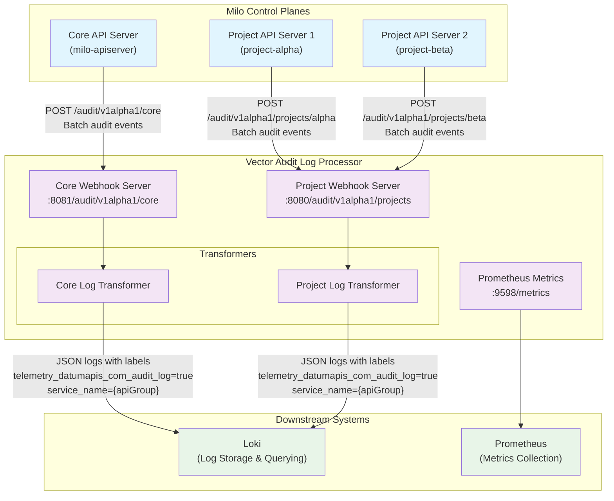

# Vector Audit Log Processor

The Vector Audit Log Processor is a telemetry component responsible for
ingesting, transforming, and forwarding Kubernetes audit logs from Milo control
planes. It provides contextual enrichment of audit events to enable
organization, project, and user-scoped log analysis.

## Architecture Overview

The Vector Audit Log Processor serves as a centralized audit log collection and
processing hub for the Milo platform. It receives audit logs from both the core
control plane and project-specific control planes, enriches them with contextual
metadata, and forwards them to downstream observability systems.



### Key Components

- **HTTP Webhook Servers**: Two dedicated endpoints for receiving audit logs
- **Log Transformers**: VRL (Vector Remap Language) scripts that enrich audit logs with contextual information
- **Loki Sink**: Forwards processed logs to Loki with rich contextual labels for efficient querying
- **Prometheus Metrics**: Exposes operational metrics for monitoring

### Log Transformation Details

#### Core Log Transformer
The core control plane transformer processes audit logs from the main Milo API server and performs the following enrichments:

- **Control Plane Type**: Adds `telemetry.miloapis.com/control-plane-type: "core"`
- **Organization Context**: Extracts organization names from:
  - Namespace patterns (e.g., `organization-{org-name}`)
  - User extra data when parent resource type is "Organization"
- **User Context**: Extracts user names from user extra data when parent resource type is "User"
- **API Group Defaulting**: Defaults core Kubernetes resources (apiVersion: v1) to "core" API group

#### Project Log Transformer
The project control plane transformer processes audit logs from project-specific API servers:

- **Control Plane Type**: Adds `telemetry.miloapis.com/control-plane-type: "project"`
- **Project Context**: Extracts project name from the webhook URL path (`/audit/v1alpha1/projects/{project-name}`)
- **API Group Defaulting**: Defaults core Kubernetes resources (apiVersion: v1) to "core" API group

Both transformers ensure that audit logs are structured with consistent metadata for downstream querying and analysis.

## Data Flow

### Core Control Plane Audit Logs
- **Source**: Core Milo API Server
- **Endpoint**: `http://vector:8081/audit/v1alpha1/core`
- **Context Added**:
  - Control plane type: `core`
  - Organization name (extracted from namespace or user extra data)
  - User name (when applicable)
  - Service name (based on API group)

### Project Control Plane Audit Logs
- **Source**: Project-specific Milo API Servers
- **Endpoint**: `http://vector:8080/audit/v1alpha1/projects/{project-name}`
- **Context Added**:
  - Control plane type: `project`
  - Project name (extracted from URL path)
  - Service name (based on API group)

## Integration with Milo API Servers

The Vector Audit Log Processor works in conjunction with:

1. **Milo API Server Deployment** (`/config/apiserver`): The main API server
   that can be configured with audit logging
2. **API Server Audit Logging Component**
   (`/config/components/apiserver-audit-logging`): A Kustomize component that
   adds audit configuration to API servers

### Enabling Audit Logging

To enable audit logging on a Milo API server, the control planes must be configured with appropriate audit webhook and audit policy configurations. This is typically accomplished by:

1. **Mounting ConfigMaps**: Mount audit policy and webhook configuration files to the API server pods at the expected locations (e.g., `/etc/kubernetes/config/`)
2. **Audit Policy Configuration**: Define which events should be audited and at what level
3. **Webhook Configuration**: Configure the API server to send audit events to the appropriate Vector endpoint:
   - Core control plane →
     `http://vector-audit-log-processor:8081/audit/v1alpha1/core`
   - Project control plane →
     `http://vector-audit-log-processor:8080/audit/v1alpha1/projects/{project-name}`

The `apiserver-audit-logging` Kustomize component provides a reference implementation for patching API server deployments with the necessary audit configuration flags and environment variables.

## Configuration

### Vector Configuration
The main configuration is defined in `vector-config.yaml` and includes:

- **Sources**: HTTP webhook servers for receiving audit logs
- **Transforms**: VRL scripts for log enrichment and contextualization
- **Sinks**: Output destinations (Loki, Prometheus metrics)

### Kubernetes Resources
- **Deployment**: Single replica Vector container with resource limits
- **Service**: Exposes ports 8080, 8081 (webhooks) and 9598 (metrics)
- **ServiceMonitor**: Prometheus monitoring configuration
- **ConfigMap**: Vector configuration via ConfigMapGenerator

## Labels and Annotations

### Added Annotations
The processor adds the following annotations to audit logs:

#### Core Control Plane
- `telemetry.miloapis.com/control-plane-type: "core"`
- `resourcemanager.miloapis.com/organization-name: "{org-name}"` (when available)
- `iam.miloapis.com/user-name: "{user-name}"` (when applicable)

#### Project Control Plane
- `telemetry.miloapis.com/control-plane-type: "project"`
- `resourcemanager.miloapis.com/project-name: "{project-name}"`

### Loki Labels
Processed logs are sent to Loki with the following labels:
- `telemetry_datumapis_com_audit_log: "true"`
- `resource_api_group: "{objectRef.apiGroup}"`
- `resource_api_version: "{objectRef.apiVersion}"`
- `resource_kind: "{objectRef.kind}"`
- `user_name: "{user.username}"`
- `organization_name: "{annotations.resourcemanager.miloapis.com/organization-name}"`
- `project_name: "{annotations.resourcemanager.miloapis.com/project-name}"`
- `control_plane_type: "{annotations.telemetry.miloapis.com/control-plane-type}"`

## Monitoring

### Metrics
The processor exposes Prometheus metrics on port 9598 including:
- Vector internal metrics (processing rates, errors, etc.)
- Custom metrics from the processing pipeline

### ServiceMonitor
A Prometheus ServiceMonitor is configured to scrape metrics every 5 seconds.

## Resource Requirements

- **CPU**: 100m request, 500m limit
- **Memory**: 256Mi request, 512Mi limit
- **Replicas**: 1 (single instance)

## Downstream Integration

### Loki
By default, processed audit logs are forwarded to:
- **Endpoint**: `http://loki-single-binary.telemetry-system.svc.cluster.local:3100`
- **Format**: JSON encoded
- **Labels**: Rich contextual labels for efficient querying

### Querying Audit Logs
Logs can be queried in Loki using the rich label set:

```logql
# All audit logs
{telemetry_datumapis_com_audit_log="true"}

# Core control plane audit logs
{control_plane_type="core"}

# Project-specific audit logs
{control_plane_type="project", project_name="my-project"}

# Organization-specific audit logs
{organization_name="my-org"}

# User-specific audit logs
{user_name="john.doe"}

# Resource-specific audit logs
{resource_api_group="resourcemanager.miloapis.com", resource_kind="Project"}

# Combined queries
{control_plane_type="project", resource_kind="Deployment", user_name="admin"}
```

## Security Considerations

- Vector runs as non-root user (65534)
- No service account token is mounted
- Network policies should restrict access to webhook endpoints
- TLS termination handled upstream (ingress/service mesh)
