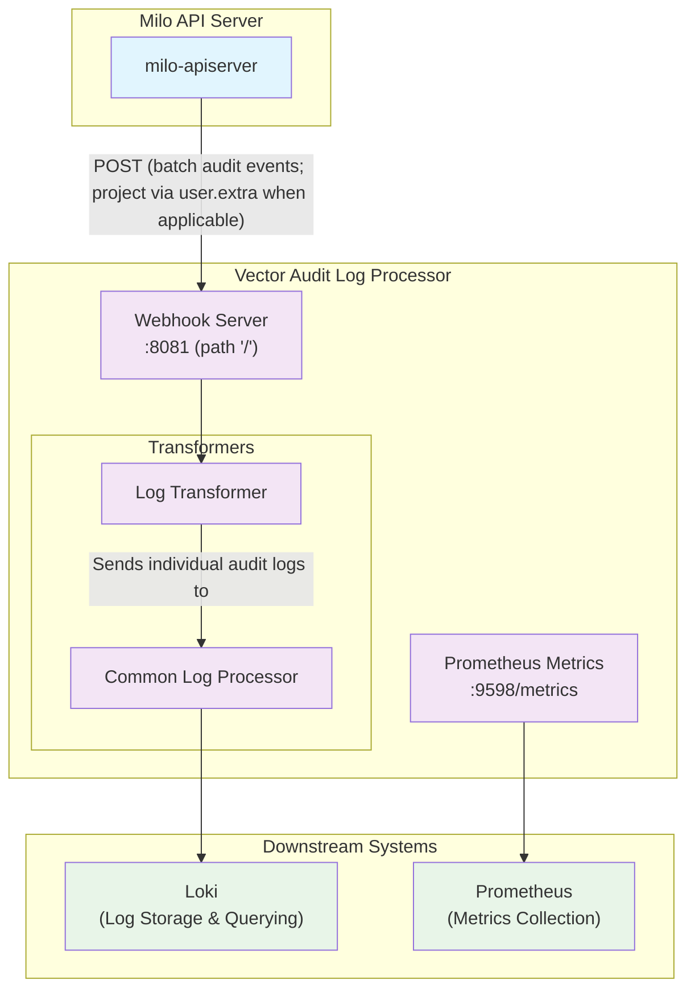

# Vector Audit Log Processor

The Vector Audit Log Processor is a telemetry component responsible for
ingesting, transforming, and forwarding Kubernetes audit logs from Milo control
planes. It provides contextual enrichment of audit events to enable
organization, project, and user-scoped log analysis.

## Architecture Overview

The Vector Audit Log Processor serves as a centralized audit log collection and
processing hub for the Milo platform. It receives audit logs from the Milo API server
(covering both platform and project-scoped requests), enriches them with contextual
metadata, and forwards them to downstream observability systems.



### Key Components

- **HTTP Webhook Servers**: Two dedicated endpoints for receiving audit logs
- **Log Transformers**: VRL (Vector Remap Language) scripts that enrich audit logs with contextual information
- **Common Log Processor**: Shared processing step that applies IP filtering and API group defaults
- **Loki Sink**: Forwards processed logs to Loki
- **Prometheus Metrics**: Exposes operational metrics for monitoring

### Log Transformation Details

#### Log Transformer
The transformer processes audit logs from the Milo API server and performs the following enrichments:

- **Control Plane Type**: Adds `telemetry.miloapis.com/control-plane-type: "project"` when project context is detected via `user.extra`; otherwise sets `"core"`
- **Organization Context**: Extracts organization names from:
  - Namespace patterns (e.g., `organization-{org-name}`)
  - User extra data when parent resource type is "Organization"
- **Project Context**: If `user.extra` indicates a parent resource of type `Project`, extracts the project name and adds annotation `resourcemanager.miloapis.com/project-name: "{project-name}"`
- **User Context**: Extracts user names from user extra data when parent resource type is "User"

#### Project Log Transformer
Consolidated into the single transformer. Project context is derived from `user.extra` when `parent-type` is `Project`.

#### Common Log Processor
The common processor applies shared transformations to all audit logs from both control planes:

- **IP Filtering**: Removes internal cluster IP addresses from `sourceIPs` arrays (RFC 1918 private ranges: 10.0.0.0/8, 172.16.0.0/12, 192.168.0.0/16, localhost, IPv6 link-local)
- **API Group Defaulting**: Defaults core Kubernetes resources (apiVersion: v1) to "core" API group

This consolidates duplicate logic and ensures consistent processing across all audit events.

## Data Flow

### Non-project (platform) Audit Logs
- **Source**: Milo API Server
- **Endpoint**: `http://vector:8081/`
- **Context Added**:
  - Control plane type: `core`
  - Organization name (extracted from namespace or user extra data)
  - User name (when applicable)
  - Service name (based on API group)

### Project-Scoped Audit Logs
- **Source**: Project-scoped requests routed through the Milo API server (virtual control planes)
- **Endpoint**: `http://vector:8081/`
- **Context Added**:
  - Control plane type: `project` (derived from `user.extra`)
  - Project name (from `iam.miloapis.com/parent-name` when `parent-type` is `Project`)
  - Service name (based on API group)

## Integration with Milo API Servers

The Vector Audit Log Processor works in conjunction with:

1. **Milo API Server Deployment** (`/config/apiserver`): The main API server
   that can be configured with audit logging
2. **API Server Audit Logging Component**
   (`/config/components/apiserver-audit-logging`): A Kustomize component that
   adds audit configuration to API servers

### Enabling Audit Logging

To enable audit logging on a Milo API server, the control planes must be configured with appropriate audit webhook and audit policy configurations. This is typically accomplished by:

1. **Mounting ConfigMaps**: Mount audit policy and webhook configuration files to the API server pods at the expected locations (e.g., `/etc/kubernetes/config/`)
2. **Audit Policy Configuration**: Define which events should be audited and at what level
3. **Webhook Configuration**: Configure the API server to send audit events to the appropriate Vector endpoint: `http://vector-audit-log-processor:8081/`

The `apiserver-audit-logging` Kustomize component provides a reference implementation for patching API server deployments with the necessary audit configuration flags and environment variables.

## Configuration

### Vector Configuration
The main configuration is defined in `vector-config.yaml` and includes:

- **Sources**: HTTP webhook servers for receiving audit logs
- **Transforms**: VRL scripts for log enrichment and contextualization
- **Sinks**: Output destinations (Loki, Prometheus metrics)

### Kubernetes Resources
- **Deployment**: Single replica Vector container with resource limits
- **Service**: Exposes ports 8080, 8081 (webhooks) and 9598 (metrics)
- **ServiceMonitor**: Prometheus monitoring configuration
- **ConfigMap**: Vector configuration via ConfigMapGenerator

## Labels and Annotations

### Added Annotations
The processor adds the following annotations to audit logs:

#### Core Control Plane
- `telemetry.miloapis.com/control-plane-type: "core"`
- `resourcemanager.miloapis.com/organization-name: "{org-name}"` (when available)
- `iam.miloapis.com/user-name: "{user-name}"` (when applicable)

#### Project Control Plane
- `telemetry.miloapis.com/control-plane-type: "project"`
- `resourcemanager.miloapis.com/project-name: "{project-name}"`

### Loki Labels
Processed logs are sent to Loki with the following label:
- `telemetry_datumapis_com_audit_log: "true"`

## Monitoring

### Metrics
The processor exposes Prometheus metrics on port 9598 including:
- Vector internal metrics (processing rates, errors, etc.)
- Custom metrics from the processing pipeline

### ServiceMonitor
A Prometheus ServiceMonitor is configured to scrape metrics every 5 seconds.

## Resource Requirements

- **CPU**: 100m request, 500m limit
- **Memory**: 256Mi request, 512Mi limit
- **Replicas**: 1 (single instance)

## Downstream Integration

### Loki
By default, processed audit logs are forwarded to:
- **Endpoint**: `http://loki-single-binary.telemetry-system.svc.cluster.local:3100`
- **Format**: JSON encoded
- **Labels**: Only the `telemetry_datumapis_com_audit_log` indicator for querying

### Querying Audit Logs
Logs can be queried in Loki using the label set:

```logql
# All audit logs
{telemetry_datumapis_com_audit_log="true"}
```

> **Note:** Fields such as `control_plane_type`, `project_name`, `organization_name`, `user_name`, and resource-related labels are present in the log event _body_ but are no longer part of Loki label sets, so queries on these must be performed via full-text or log content search, not as indexed labels.

## Security Considerations

- Vector runs as non-root user (65534)
- No service account token is mounted
- Network policies should restrict access to webhook endpoints
- TLS termination handled upstream (ingress/service mesh)

  