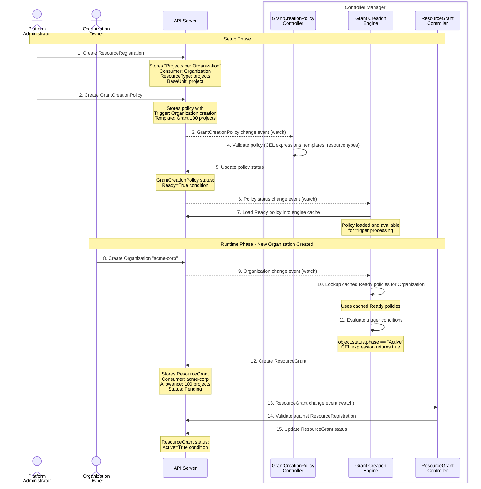
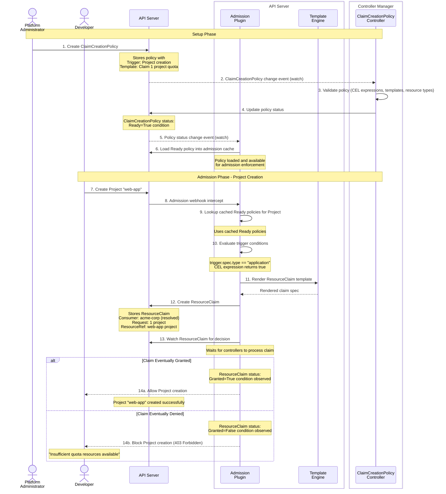
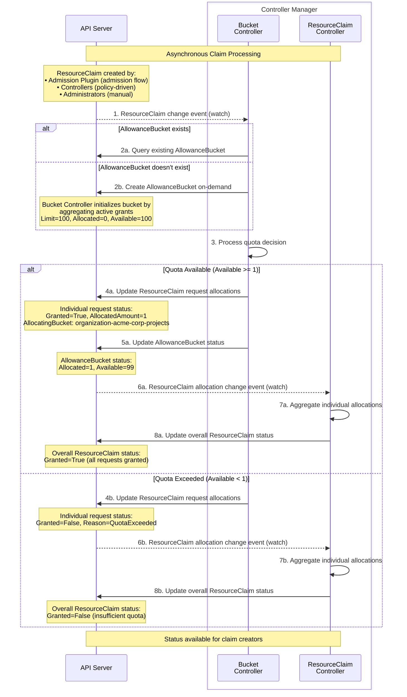

<!-- omit from toc -->
# Milo Quota System Architecture

- [System Overview](#system-overview)
  - [Purpose](#purpose)
  - [Design Principles](#design-principles)
  - [Key Components](#key-components)
  - [Runtime Architecture](#runtime-architecture)
- [Core Concepts](#core-concepts)
  - [ResourceRegistration](#resourceregistration)
  - [ResourceGrant](#resourcegrant)
  - [AllowanceBucket](#allowancebucket)
  - [ResourceClaim](#resourceclaim)
- [Policy Automation](#policy-automation)
  - [GrantCreationPolicy](#grantcreationpolicy)
  - [ClaimCreationPolicy](#claimcreationpolicy)
- [Data Flows](#data-flows)
  - [Quota Provisioning Flow](#quota-provisioning-flow)
  - [Admission Control Flow](#admission-control-flow)
  - [Resource Claiming Flow](#resource-claiming-flow)
- [Resource Cleanup](#resource-cleanup)
- [Operational Visibility](#operational-visibility)
  - [kube-state-metrics Integration](#kube-state-metrics-integration)
  - [Quota System Implementation Metrics](#quota-system-implementation-metrics)
  - [Monitoring and Alerting](#monitoring-and-alerting)

## System Overview

The Milo quota system provides real-time resource consumption control through a
comprehensive framework that automates quota provisioning, enforces limits
during resource creation, and maintains accurate usage tracking across
distributed deployments.

### Purpose

The quota system enables platform administrators to define resource consumption
limits and automatically enforce them without manual intervention. It provides:

- **Real-time Enforcement**: Blocks resource creation when quota limits are
  exceeded
- **Automated Provisioning**: Dynamically allocates quota based on
  organizational policies
- **Multi-Resource Support**: Tracks consumption across different resource types
- **Distributed Operation**: Manages quota across multiple Milo deployments
- **Audit Trail**: Maintains complete history of quota decisions and allocations

### Design Principles

- **Declarative Configuration**: All quota rules are defined through API
  resources, enabling version control and reproducible deployments
- **Event-Driven Architecture**: Components react to resource lifecycle events,
  ensuring quota decisions reflect real-time system state
- **Separation of Concerns**: Clear boundaries between quota allocation
  (grants), consumption (claims), and enforcement (admission control)
- **Controller-Based**: Uses reconciliation loops to maintain desired state and
  handle eventual consistency

### Key Components

The quota system consists of four main component types that work together:

- **Configuration**: ResourceRegistration defines which resource types can be
  tracked and consumed by which entity types
- **Automation**: GrantCreationPolicy and ClaimCreationPolicy automate quota
  allocation and enforcement based on resource lifecycle events
- **Resources**: ResourceGrant allocates quota capacity, ResourceClaim requests
  quota consumption, and AllowanceBucket aggregates real-time availability
- **Runtime**: Controllers coordinate between resources and admission webhooks
  enforce quota decisions during resource creation

### Runtime Architecture

The quota system uses an event-driven architecture built on informers, which
provide efficient resource watching and caching:

**Informers and Watches**:
- Controllers use informers to watch API resources for changes (create, update,
  delete events)
- Each informer maintains a local cache that's automatically kept in sync with
  the API server
- Controllers react to events from informers rather than polling the API server
- Multiple controllers can share informers to reduce API server load and memory
  usage

**Key Informer Usage Patterns**:

*Controller Watches*:
- AllowanceBucket Controller watches ResourceGrants and ResourceClaims to
  maintain aggregated quota state
- ResourceGrant Controller watches ResourceRegistrations to validate grant
  configurations
- Policy controllers watch trigger resources dynamically based on policy
  specifications
- All controllers use predicate filters to ignore irrelevant events

*Admission Plugin Components*:
- **ClaimWatchManager**: Maintains informers for ResourceClaims to track quota
  decisions
  - Creates temporary watches when admission requests create ResourceClaims
  - Waits for claim status updates to allow/deny resource creation
  - Cleans up watches after decisions are made or timeouts occur
- **Policy Engine**: Caches ClaimCreationPolicies using informers for fast
  lookup during admission

*Shared Components*:
- **ResourceTypeValidator**: Uses informers to maintain a cache of all
  registered resource types
  - Shared across controllers and admission plugin to validate resource
    references
  - Asynchronously initialized to prevent startup blocking
  - Provides efficient type checking without API calls
- **Grant Creation Engine**: Watches resources specified in
  GrantCreationPolicies
  - Dynamically creates informers based on policy trigger specifications
  - Evaluates CEL expressions against cached resources

This informer-based architecture ensures the quota system can handle high-scale
operations with minimal API server load while maintaining real-time
responsiveness.

## Core Concepts

### ResourceRegistration

Defines which resource types can be tracked and establishes relationships
between consumers and resources.

```yaml
apiVersion: quota.miloapis.com/v1alpha1
kind: ResourceRegistration
metadata:
  name: projects-per-organization
spec:
  consumerType:
    apiGroup: resourcemanager.miloapis.com
    kind: Organization
  type: Entity
  resourceType: resourcemanager.miloapis.com/projects
  baseUnit: project
  claimingResources:
  - apiGroup: resourcemanager.miloapis.com
    kind: Project
```

**Key Responsibilities:**
- Resource type identity and measurement specifications
- Consumer relationship definitions (Organizations consume Project quota)
- Authorization for which resources can create claims

### ResourceGrant

Allocates concrete quota capacity to specific consumers. Multiple grants for the
same consumer and resource type are automatically aggregated.

```yaml
apiVersion: quota.miloapis.com/v1alpha1
kind: ResourceGrant
metadata:
  name: acme-corp-project-quota
spec:
  consumerRef:
    apiGroup: resourcemanager.miloapis.com
    kind: Organization
    name: acme-corp
  allowances:
  - resourceType: resourcemanager.miloapis.com/projects
    buckets:
    - amount: 50
```

**Key Responsibilities:**
- Capacity allocation to consumers
- Multi-resource support in single grants
- Source attribution for billing and reporting

### AllowanceBucket

Central aggregation point that combines quota capacity from ResourceGrants and
tracks consumption from ResourceClaims, providing real-time availability
calculations.

**Status Example:**
```yaml
status:
  limit: 100        # From active ResourceGrants
  allocated: 25     # From granted ResourceClaims
  available: 75     # limit - allocated
  contributingGrantRefs:
  - name: basic-quota-grant
    amount: 50
  - name: bonus-quota-grant
    amount: 50
```

**Key Responsibilities:**
- Aggregates capacity from all active ResourceGrants
- Tracks consumption from all granted ResourceClaims
- Provides Available = Limit - Allocated for admission decisions
- Created on-demand when first referenced

### ResourceClaim

Requests quota allocation during resource creation, linking to triggering
resources for lifecycle management.

```yaml
apiVersion: quota.miloapis.com/v1alpha1
kind: ResourceClaim
metadata:
  name: web-app-project-claim-abc123
spec:
  consumerRef:
    apiGroup: resourcemanager.miloapis.com
    kind: Organization
    name: acme-corp
  requests:
  - resourceType: resourcemanager.miloapis.com/projects
    amount: 1
  resourceRef:
    apiGroup: resourcemanager.miloapis.com
    kind: Project
    name: web-app-project
```

**Key Responsibilities:**
- Quota requests during resource creation
- Consumer identification and resource linking
- Atomic all-or-nothing allocation for multi-resource requests

## Policy Automation

### GrantCreationPolicy

Automates ResourceGrant creation based on resource lifecycle events, eliminating
manual quota provisioning.

```yaml
apiVersion: quota.miloapis.com/v1alpha1
kind: GrantCreationPolicy
metadata:
  name: organization-project-quota
spec:
  trigger:
    resource:
      apiVersion: resourcemanager.miloapis.com/v1alpha1
      kind: Organization
    constraints:
    - expression: 'trigger.status.phase == "Active"'
  target:
    resourceGrantTemplate:
      spec:
        consumerRef:
          apiGroup: resourcemanager.miloapis.com
          kind: Organization
          name: '{{ trigger.metadata.name}}'
        allowances:
        - resourceType: resourcemanager.miloapis.com/projects
          buckets:
          - amount: 50
```

**Capabilities:**
- Watches any Kubernetes resource type for changes
- CEL expressions for flexible trigger conditions
- CEL based template expressions delineated by `{{ }}`
- Cross-cluster grant creation via parent context resolution

### ClaimCreationPolicy

Automates ResourceClaim creation during admission control, providing real-time
quota enforcement.

```yaml
apiVersion: quota.miloapis.com/v1alpha1
kind: ClaimCreationPolicy
metadata:
  name: project-quota-enforcement
spec:
  trigger:
    resource:
      apiVersion: resourcemanager.miloapis.com/v1alpha1
      kind: Project
    constraints:
    - expression: 'trigger.spec.type == "application"'
  target:
    resourceClaimTemplate:
      spec:
        consumerRef:
          apiGroup: resourcemanager.miloapis.com
          kind: Organization
          name: '{{ trigger.spec.ownerRef.name }}'
        requests:
        - resourceType: resourcemanager.miloapis.com/projects
          amount: 1
```

**Capabilities:**
- Integrates with Kubernetes admission controller framework
- Creates claims during resource creation requests
- Blocks resource creation when quota is exceeded
- Automatic consumer resolution via parent context

## Data Flows

### Quota Provisioning Flow

This flow shows how quota capacity is automatically allocated when new consumers
are created in the system.



**Key Points:**
- Trigger evaluation: Grant Creation Engine watches for resource changes and
  evaluates CEL expressions
- Template rendering: Grant templates use context from triggering resources
- Validation: ResourceGrants are validated against ResourceRegistrations
- Bucket creation: AllowanceBuckets are created on-demand when first
  ResourceClaim references them

### Admission Control Flow

This flow shows how the admission webhook intercepts resource creation and
generates ResourceClaims for quota evaluation.



**Key Points:**
- Synchronous admission: The webhook blocks resource creation until
  ResourceClaim is processed
- Policy lookup: Admission plugin maintains indexed ClaimCreationPolicies for
  fast lookup
- Template context: Claim templates access triggering resource, user context,
  and request information
- Watch pattern: Admission plugin waits for ResourceClaim status updates via
  shared informers

### Resource Claiming Flow

This flow shows how controllers asynchronously process ResourceClaims to make
quota decisions and update bucket allocations.



**Key Points:**
- Asynchronous processing: Controllers process ResourceClaims independently of
  admission
- On-demand bucket creation: AllowanceBuckets created when first ResourceClaim
  references them
- Atomic decisions: All requests within a ResourceClaim must be satisfied, or
  entire claim is denied
- Controller separation: Bucket Controller makes quota decisions, ResourceClaim
  Controller aggregates results

## Resource Cleanup

When resources are deleted, the quota system automatically reclaims allocated
quota through owner references and garbage collection:

**ResourceClaim Cleanup**:
- ResourceClaims include owner references to their triggering resources (e.g.,
  Project)
- When the triggering resource is deleted, the system automatically deletes the
  ResourceClaim
- Bucket Controller detects ResourceClaim deletion and updates AllowanceBucket
  allocated amounts
- Quota capacity becomes available for new claims immediately

**ResourceGrant Cleanup**:
- Policy-created ResourceGrants are cleaned up when their trigger resources are
  deleted
- Manual ResourceGrants persist until explicitly deleted by administrators
- When ResourceGrants are deleted, Bucket Controller recalculates
  AllowanceBucket limits
- Any ResourceClaims that exceed the new reduced limits are marked as denied

**AllowanceBucket Cleanup**:
- AllowanceBuckets are automatically deleted when no active ResourceGrants or
  ResourceClaims reference them
- This prevents resource accumulation and maintains a clean quota state

The cleanup process ensures quota capacity is immediately reclaimed without manual intervention, maintaining accurate quota availability for future resource creation requests.

## Operational Visibility

The quota system provides comprehensive operational visibility through two complementary metric systems: kube-state-metrics for resource state tracking and application-level metrics for runtime behavior monitoring.

### kube-state-metrics Integration

The quota system integrates with [kube-state-metrics](https://github.com/kubernetes/kube-state-metrics) to expose resource state as Prometheus metrics. [Custom resource state metrics](https://github.com/kubernetes/kube-state-metrics/blob/main/docs/customresourcestate-metrics.md) are configured for all quota resources, providing detailed visibility into quota configuration and status.

**ResourceRegistration Metrics**:
- `milo_quota_registration_info`: Registration metadata including consumer type, resource type, registration type, units
  - Labels: `uid`, `name`, `description`, `consumer_api_group`, `consumer_kind`, `resource_type`, `registration_type`, `base_unit`, `display_unit`, `unit_conversion_factor`
- `milo_quota_registration_status_condition`: Ready/Active status conditions
  - Labels: `type`, `status`
- `milo_quota_registration_observed_generation`: Controller processing progress
- `milo_quota_registration_current_generation`: Resource specification version

**ClaimCreationPolicy Metrics**:
- `milo_quota_claim_policy_info`: Policy metadata and configuration
  - Labels: `uid`, `name`, `target_api_version`, `target_kind`, `enabled`
- `milo_quota_claim_policy_status_condition`: Ready status conditions
  - Labels: `type`, `status`
- `milo_quota_claim_policy_enabled`: Policy enablement state (1=enabled, 0=disabled)
- `milo_quota_claim_policy_observed_generation`: Controller processing progress
- `milo_quota_claim_policy_current_generation`: Policy specification version

**GrantCreationPolicy Metrics**:
- `milo_quota_grant_policy_info`: Policy metadata and target configuration
  - Labels: `uid`, `name`, `trigger_api_version`, `trigger_kind`, `parent_context_api_group`, `parent_context_kind`, `enabled`
- `milo_quota_grant_policy_status_condition`: Ready status conditions
  - Labels: `type`, `status`
- `milo_quota_grant_policy_enabled`: Policy enablement state (1=enabled, 0=disabled)
- `milo_quota_grant_policy_observed_generation`: Controller processing progress
- `milo_quota_grant_policy_current_generation`: Policy specification version

**ResourceGrant Metrics**:
- `milo_quota_grant_info`: Grant metadata and consumer references
  - Labels: `uid`, `name`, `namespace`, `consumer_api_group`, `consumer_kind`, `consumer_name`
- `milo_quota_grant_status_condition`: Active status conditions
  - Labels: `type`, `status`
- `milo_quota_grant_observed_generation`: Controller processing progress
- `milo_quota_grant_current_generation`: Grant specification version

**ResourceClaim Metrics**:
- `milo_quota_claim_info`: Claim metadata with consumer and triggering resource references
  - Labels: `uid`, `name`, `namespace`, `consumer_api_group`, `consumer_kind`, `consumer_name`, `triggering_resource_api_group`, `triggering_resource_kind`, `triggering_resource_name`, `triggering_resource_namespace`
- `milo_quota_claim_status_condition`: Granted/Denied status conditions
  - Labels: `type`, `status`
- `milo_quota_claim_observed_generation`: Controller processing progress
- `milo_quota_claim_current_generation`: Claim specification version

**AllowanceBucket Metrics**:
- `milo_quota_bucket_info`: Bucket metadata and consumer references
  - Labels: `uid`, `name`, `namespace`, `consumer_api_group`, `consumer_kind`, `consumer_name`, `resource_type`
- `milo_quota_bucket_limit`: Total quota capacity from contributing grants
- `milo_quota_bucket_allocated`: Total quota consumed by granted claims
- `milo_quota_bucket_available`: Available quota capacity (limit - allocated)
- `milo_quota_bucket_claim_count`: Number of claims consuming from this bucket
- `milo_quota_bucket_grant_count`: Number of grants contributing to this bucket
- `milo_quota_bucket_last_reconciliation_timestamp`: Time of last bucket update
- `milo_quota_bucket_observed_generation`: Controller processing progress
- `milo_quota_bucket_current_generation`: Bucket specification version

All metrics include `component: quota_system` and `resource_type` labels for filtering and aggregation.

**Configuration Location**: `/Users/scotwells/repos/datum-cloud/milo/config/services/quota/telemetry/metrics/control-plane/`

### Quota System Implementation Metrics

The quota system exposes application-level Prometheus metrics that provide visibility into runtime behavior, performance, and operational health. These metrics are exposed on the standard Kubernetes `/metrics` endpoint.

**Admission Plugin Metrics**:

*Decision Tracking*:
- `milo_quota_admission_result_total`: Total admission decisions by outcome
  - Labels: `result` (granted|denied|policy_disabled), `policy_name`, `policy_namespace`, `resource_group`, `resource_kind`
  - Use case: Track quota enforcement patterns and denial rates per policy

*Watch Manager Performance*:
- `milo_quota_waiters_current`: Current number of active ResourceClaim waiters
  - Use case: Monitor concurrent admission requests and system load
- `milo_quota_wait_register_total`: Total waiter registrations
  - Use case: Track admission request volume over time
- `milo_quota_wait_unregister_total`: Total waiter unregistrations
  - Use case: Monitor waiter lifecycle completion
- `milo_quota_wait_time_seconds`: Time from waiter registration to final result (histogram)
  - Labels: `result` (granted|denied|timeout|not_found)
  - Buckets: [0.01, 0.05, 0.1, 0.25, 0.5, 1, 2, 5, 10, 20, 30, 60]
  - Use case: Track admission latency and identify slow quota decisions
- `milo_quota_informer_events_total`: ResourceClaim events observed by shared informer
  - Labels: `type` (add|update|delete|unknown)
  - Use case: Monitor informer activity and event processing rates

*Policy Engine Performance*:
- `milo_quota_policy_informer_events_total`: ClaimCreationPolicy events observed by shared informer
  - Labels: `type` (add|update|delete|unknown)
  - Use case: Track policy lifecycle events and cache updates
- `milo_quota_policy_load_total`: Total ClaimCreationPolicy load operations
  - Use case: Monitor policy cache refresh frequency
- `milo_quota_policies_active`: Current number of active ClaimCreationPolicy objects in cache
  - Use case: Track active policy count for capacity planning

**Standard client-go Metrics** (Namespace: `workqueue`):
- The quota system uses named workqueues that expose [standard client-go workqueue metrics](https://github.com/kubernetes/client-go/blob/master/util/workqueue/metrics.go):
  - `workqueue_*{name="quota_admission_claim_watch"}`: Admission plugin watch manager metrics
  - `workqueue_*{name="quota_policy_engine"}`: Policy engine workqueue metrics
- Available metrics include: `depth`, `adds_total`, `latency_seconds`, `work_duration_seconds`, `unfinished_work_seconds`, `longest_running_processor_seconds`, `retries_total`

**Metric Registration**: All quota system metrics are registered with the [Kubernetes legacy registry](https://pkg.go.dev/k8s.io/component-base/metrics/legacyregistry) (`k8s.io/component-base/metrics/legacyregistry`) during initialization, ensuring they appear on the apiserver `/metrics` endpoint alongside standard Kubernetes metrics.

**Implementation Locations**:
- Admission Plugin: `/Users/scotwells/repos/datum-cloud/milo/internal/quota/admission/plugin.go:44-59`
- Watch Manager: `/Users/scotwells/repos/datum-cloud/milo/internal/quota/admission/watch_manager.go:58-107`
- Policy Engine: `/Users/scotwells/repos/datum-cloud/milo/internal/quota/engine/policy.go:26-62`

### Monitoring and Alerting

The quota system metrics support comprehensive monitoring through [Prometheus](https://prometheus.io/) and visualization through [Grafana](https://grafana.com/). The following sections provide [PromQL](https://prometheus.io/docs/prometheus/latest/querying/basics/) queries for common operational scenarios.

**Key Monitoring Scenarios**:

*Quota Exhaustion Detection*:
```promql
# Organizations approaching quota limits (>90% utilized)
(milo_quota_bucket_allocated / milo_quota_bucket_limit) > 0.9
```

*Admission Performance*:
```promql
# 95th percentile admission latency by result
histogram_quantile(0.95,
  rate(milo_quota_wait_time_seconds_bucket[5m])
) by (result)

# High denial rates
rate(milo_quota_admission_result_total{result="denied"}[5m])
```

*System Health*:
```promql
# Stale AllowanceBuckets (not reconciled in 5 minutes)
(time() - milo_quota_bucket_last_reconciliation_timestamp) > 300

# High waiter counts indicating system load
milo_quota_waiters_current > 100

# Policy cache stability
rate(milo_quota_policy_load_total[5m])
```

*Resource State Tracking*:
```promql
# Claims in pending state (condition status != True|False)
milo_quota_claim_status_condition{type="Granted", status="Unknown"}

# Policies not ready
milo_quota_claim_policy_status_condition{type="Ready", status="False"}
```

**Dashboard Recommendations**:
- Quota utilization panels showing allocated vs limit per consumer
- Admission latency histograms with breakdown by result type
- Active waiter counts and policy cache size trends
- Denial rate trends with policy and resource type breakdowns
- Workqueue metrics for processing delay detection
