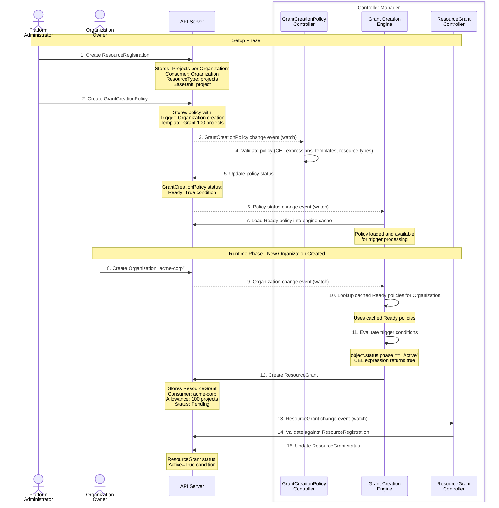
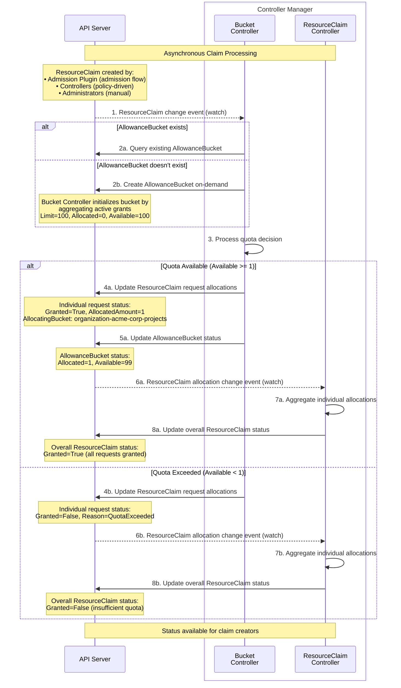

<!-- omit from toc -->
# Milo Quota System Architecture

- [System Overview](#system-overview)
  - [Purpose](#purpose)
  - [Design Principles](#design-principles)
  - [Key Components](#key-components)
  - [Runtime Architecture](#runtime-architecture)
- [Core Concepts](#core-concepts)
  - [ResourceRegistration](#resourceregistration)
  - [ResourceGrant](#resourcegrant)
  - [AllowanceBucket](#allowancebucket)
  - [ResourceClaim](#resourceclaim)
- [Policy Automation](#policy-automation)
  - [GrantCreationPolicy](#grantcreationpolicy)
  - [ClaimCreationPolicy](#claimcreationpolicy)
- [Data Flows](#data-flows)
  - [Quota Provisioning Flow](#quota-provisioning-flow)
  - [Admission Control Flow](#admission-control-flow)
  - [Resource Claiming Flow](#resource-claiming-flow)
- [Resource Cleanup](#resource-cleanup)
- [Operational Visibility](#operational-visibility)
  - [kube-state-metrics Integration](#kube-state-metrics-integration)
  - [Quota System Implementation Metrics](#quota-system-implementation-metrics)
  - [Monitoring and Alerting](#monitoring-and-alerting)

## System Overview

The Milo quota system controls resource consumption in real time. The system
automates quota provisioning, enforces limits during resource creation, and
tracks usage across distributed deployments.

### Purpose

Platform administrators define resource consumption limits through the quota
system. The system enforces these limits without manual intervention and provides:

- **Real-time Enforcement**: Blocks resource creation when quota limits are
  exceeded
- **Automated Provisioning**: Dynamically allocates quota based on
  organizational policies
- **Multi-Resource Support**: Tracks consumption across different resource types
- **Distributed Operation**: Manages quota across multiple Milo deployments
- **Audit Trail**: Maintains complete history of quota decisions and allocations

### Design Principles

- **Declarative Configuration**: Define all quota rules through API resources,
  enabling version control and reproducible deployments
- **Event-Driven Architecture**: Components react to resource lifecycle events,
  ensuring quota decisions reflect real-time system state
- **Separation of Concerns**: Clear boundaries between quota allocation
  (grants), consumption (claims), and enforcement (admission control)
- **Controller-Based**: Uses reconciliation loops to maintain desired state and
  handle eventual consistency

### Key Components

The quota system includes four main component types:

- **Configuration**: ResourceRegistration defines which resource types the
  system tracks and which entity types consume them
- **Automation**: GrantCreationPolicy and ClaimCreationPolicy automate quota
  allocation and enforcement based on resource lifecycle events
- **Resources**: ResourceGrant allocates quota capacity, ResourceClaim requests
  quota consumption, and AllowanceBucket aggregates real-time availability
- **Runtime**: Controllers coordinate between resources and admission webhooks
  enforce quota decisions during resource creation

### Runtime Architecture

The quota system uses an event-driven architecture with different watching patterns optimized for each component:

**Controller Watches**:
- Controllers use standard Kubernetes informers for resource watching and caching
- AllowanceBucket Controller watches ResourceGrants and ResourceClaims to maintain aggregated quota state
- ResourceGrant Controller watches ResourceRegistrations to validate grant configurations
- Policy controllers watch trigger resources dynamically based on policy specifications
- All controllers use predicate filters to ignore irrelevant events

**Admission Plugin - Stream-Based Watch Manager**:

The admission plugin uses a **stream-based watch pattern** optimized for real-time, request-time enforcement:

- **Direct Watch Streams**: No SharedInformer or cache; connects directly to Kubernetes watch API
- **Fast Startup**: Begins watching from "now" using `Limit=0` LIST (1-10ms startup vs 10-500ms for informers)
- **Minimal Memory**: Only tracks active waiters (~10KB per waiter) instead of full claim cache (~1-10MB)
- **TTL-based Lifecycle**: Watch managers automatically start when needed and stop after 5 minutes of inactivity
- **Dynamic Per-Project Watches**: Creates separate watch manager for each project control plane
- **Infinite Retry**: Exponential backoff with jitter (100ms → 30s) for transient failures; never gives up
- **Bookmark Resumption**: Uses Kubernetes watch bookmarks to resume efficiently after disconnects
- **410 Gone Handling**: Restarts from current time when resourceVersion expires

**Key Watch Manager Characteristics**:

1. **Watch-Before-Claim Pattern**: Establishes watch stream before creating ResourceClaim, guaranteeing zero missed events
2. **Deterministic Claim Naming**: Uses hash-based names allowing waiter pre-registration before claim exists
3. **Stateless Operation**: No persistent cache; state is derived from active admission requests
4. **Multi-Project Scalability**: O(active projects) instead of O(total projects) resource usage

**Shared Components**:
- **ResourceTypeValidator**: Uses informers to maintain a cache of all registered resource types
  - Shared across controllers and admission plugin to validate resource references
  - Asynchronously initialized to prevent startup blocking
  - Provides efficient type checking without API calls
- **Policy Engine**: Caches ClaimCreationPolicies using informers for fast lookup during admission
- **Grant Creation Engine**: Watches resources specified in GrantCreationPolicies
  - Dynamically creates informers based on policy trigger specifications
  - Evaluates CEL expressions against cached resources

This hybrid architecture ensures controllers benefit from informer caching for background reconciliation while the admission plugin achieves minimal latency and resource usage for synchronous request-time enforcement.

## Core Concepts

### ResourceRegistration

ResourceRegistration defines which resource types the system tracks and
establishes relationships between consumers and resources.

```yaml
apiVersion: quota.miloapis.com/v1alpha1
kind: ResourceRegistration
metadata:
  name: projects-per-organization
spec:
  consumerType:
    apiGroup: resourcemanager.miloapis.com
    kind: Organization
  type: Entity
  resourceType: resourcemanager.miloapis.com/projects
  baseUnit: project
  claimingResources:
  - apiGroup: resourcemanager.miloapis.com
    kind: Project
```

**Key Responsibilities:**
- Define resource type identity and measurement specifications
- Define consumer relationships (Organizations consume Project quota)
- Authorize which resources can create claims

### ResourceGrant

ResourceGrant allocates quota capacity to specific consumers. The system
automatically aggregates multiple grants for the same consumer and resource type.

```yaml
apiVersion: quota.miloapis.com/v1alpha1
kind: ResourceGrant
metadata:
  name: acme-corp-project-quota
spec:
  consumerRef:
    apiGroup: resourcemanager.miloapis.com
    kind: Organization
    name: acme-corp
  allowances:
  - resourceType: resourcemanager.miloapis.com/projects
    buckets:
    - amount: 50
```

**Key Responsibilities:**
- Allocate capacity to consumers
- Support multiple resources in single grants
- Attribute sources for billing and reporting

### AllowanceBucket

AllowanceBucket aggregates quota capacity from ResourceGrants and tracks
consumption from ResourceClaims. The bucket calculates real-time quota
availability.

**Status Example:**
```yaml
status:
  limit: 100        # From active ResourceGrants
  allocated: 25     # From granted ResourceClaims
  available: 75     # limit - allocated
  contributingGrantRefs:
  - name: basic-quota-grant
    amount: 50
  - name: bonus-quota-grant
    amount: 50
```

**Key Responsibilities:**
- Aggregate capacity from all active ResourceGrants
- Track consumption from all granted ResourceClaims
- Calculate available quota (Available = Limit - Allocated) for admission decisions
- Create buckets on-demand when first referenced

### ResourceClaim

ResourceClaim requests quota allocation during resource creation and links to
triggering resources for lifecycle management.

```yaml
apiVersion: quota.miloapis.com/v1alpha1
kind: ResourceClaim
metadata:
  name: web-app-project-claim-abc123
spec:
  consumerRef:
    apiGroup: resourcemanager.miloapis.com
    kind: Organization
    name: acme-corp
  requests:
  - resourceType: resourcemanager.miloapis.com/projects
    amount: 1
  resourceRef:
    apiGroup: resourcemanager.miloapis.com
    kind: Project
    name: web-app-project
```

**Key Responsibilities:**
- Request quota during resource creation
- Identify consumers and link to resources
- Ensure atomic all-or-nothing allocation for multi-resource requests

## Policy Automation

### GrantCreationPolicy

GrantCreationPolicy automates ResourceGrant creation based on resource lifecycle
events, eliminating manual quota provisioning.

```yaml
apiVersion: quota.miloapis.com/v1alpha1
kind: GrantCreationPolicy
metadata:
  name: organization-project-quota
spec:
  trigger:
    resource:
      apiVersion: resourcemanager.miloapis.com/v1alpha1
      kind: Organization
    constraints:
    - expression: 'trigger.status.phase == "Active"'
  target:
    resourceGrantTemplate:
      spec:
        consumerRef:
          apiGroup: resourcemanager.miloapis.com
          kind: Organization
          name: '{{ trigger.metadata.name}}'
        allowances:
        - resourceType: resourcemanager.miloapis.com/projects
          buckets:
          - amount: 50
```

**Capabilities:**
- Watch any Kubernetes resource type for changes
- Use CEL expressions for flexible trigger conditions
- Define templates with CEL expressions in `{{ }}` delimiters
- Create grants across clusters via parent context resolution

### ClaimCreationPolicy

ClaimCreationPolicy automates ResourceClaim creation during admission control to
enforce quota in real time.

```yaml
apiVersion: quota.miloapis.com/v1alpha1
kind: ClaimCreationPolicy
metadata:
  name: project-quota-enforcement
spec:
  trigger:
    resource:
      apiVersion: resourcemanager.miloapis.com/v1alpha1
      kind: Project
    constraints:
    - expression: 'trigger.spec.type == "application"'
  target:
    resourceClaimTemplate:
      spec:
        consumerRef:
          apiGroup: resourcemanager.miloapis.com
          kind: Organization
          name: '{{ trigger.spec.ownerRef.name }}'
        requests:
        - resourceType: resourcemanager.miloapis.com/projects
          amount: 1
```

**Capabilities:**
- Integrate with Kubernetes admission controller framework
- Create claims during resource creation requests
- Block resource creation when quota is exceeded
- Resolve consumers automatically via parent context

## Data Flows

### Quota Provisioning Flow

This flow shows how the system allocates quota capacity when new consumers are
created.



**Key Points:**
- **Trigger evaluation**: Grant Creation Engine watches for resource changes and
  evaluates CEL expressions
- **Template rendering**: Grant templates use context from triggering resources
- **Validation**: The system validates ResourceGrants against ResourceRegistrations
- **Bucket creation**: The system creates AllowanceBuckets on-demand when the
  first ResourceClaim references them

### Admission Control Flow

This flow shows how the admission webhook intercepts resource creation and
generates ResourceClaims for quota evaluation.

```mermaid
sequenceDiagram
    actor PlatformAdmin as Platform<br/>Administrator
    actor Developer as Developer
    participant API as API Server

    box API Server
        participant Plugin as Admission<br/>Plugin
        participant TE as Template<br/>Engine
    end

    box Controller Manager
        participant CCP as ClaimCreationPolicy<br/>Controller
    end

    Note over PlatformAdmin,CCP: Setup Phase
    PlatformAdmin->>API: 1. Create ClaimCreationPolicy
    Note over API: Stores policy with<br/>Trigger: Project creation<br/>Template: Claim 1 project quota

    API-->>CCP: 2. ClaimCreationPolicy change event (watch)
    CCP->>CCP: 3. Validate policy (CEL expressions, templates, resource types)
    CCP->>API: 4. Update policy status
    Note over API: ClaimCreationPolicy status:<br/>Ready=True condition

    API-->>Plugin: 5. Policy status change event (watch)
    Plugin->>API: 6. Load Ready policy into admission cache
    Note over Plugin: Policy loaded and available<br/>for admission enforcement

    Note over Developer,CCP: Admission Phase - Project Creation
    Developer->>API: 7. Create Project "web-app"
    API->>Plugin: 8. Admission webhook intercept

    Plugin->>Plugin: 9. Lookup cached Ready policies for Project
    Note over Plugin: Uses cached Ready policies

    Plugin->>Plugin: 10. Evaluate trigger conditions
    Note over Plugin: trigger.spec.type == "application"<br/>CEL expression returns true

    Plugin->>Plugin: 11. Get/Create Watch Manager for project
    Note over Plugin: Creates per-project watch manager with TTL<br/>Uses direct watch stream (not informer)<br/>Startup: 1-10ms with Limit=0 LIST

    Plugin->>TE: 12. Render ResourceClaim template
    TE-->>Plugin: Rendered claim spec

    Plugin->>Plugin: 13. Generate deterministic claim name
    Note over Plugin: Hash-based name: policy + resource GVK + name

    Plugin->>Plugin: 14. Register waiter BEFORE creating claim
    Note over Plugin: Watch-before-claim pattern prevents race<br/>Waiter registered, watch stream active

    Plugin->>API: 15. Create ResourceClaim with predetermined name
    Note over API: Stores ResourceClaim<br/>Consumer: acme-corp (resolved)<br/>Request: 1 project<br/>ResourceRef: web-app project

    Note over Plugin: Watch manager receives events via direct watch stream<br/>Waiter already registered; guaranteed event delivery

    alt Claim Eventually Granted
        Note over Plugin: ResourceClaim status:<br/>Granted=True condition observed via watch
        Plugin-->>Developer: 16a. Allow Project creation
        Note over API: Project "web-app" created successfully

    else Claim Eventually Denied
        Note over Plugin: ResourceClaim status:<br/>Granted=False condition observed via watch
        Plugin-->>Developer: 16b. Block Project creation (403 Forbidden)
        Note over Developer: "Insufficient quota resources available"
    end

    Note over Plugin: After 5 minutes of no activity,<br/>watch manager automatically stops (TTL expiration)
```

**Key Points:**
- **Synchronous admission**: The webhook blocks resource creation until the
  ResourceClaim is processed
- **Policy lookup**: Admission plugin maintains indexed ClaimCreationPolicies for
  fast lookup
- **Template context**: Claim templates access the triggering resource, user
  context, and request information
- **Watch-before-claim pattern**: The system establishes the watch stream and
  registers the waiter before claim creation, guaranteeing zero missed events
- **Direct watch streams**: No informer or cache overhead; minimal memory
  footprint and fast startup (1-10ms)
- **TTL-based lifecycle**: Watch managers clean up after 5 minutes of inactivity,
  scaling resources with active projects

### Resource Claiming Flow

This flow shows how controllers asynchronously process ResourceClaims to make
quota decisions and update bucket allocations.



**Key Points:**
- **Asynchronous processing**: Controllers process ResourceClaims independently
  of admission
- **On-demand bucket creation**: The system creates AllowanceBuckets when the
  first ResourceClaim references them
- **Atomic decisions**: All requests within a ResourceClaim must be satisfied, or
  the system denies the entire claim
- **Controller separation**: Bucket Controller makes quota decisions;
  ResourceClaim Controller aggregates results

## Resource Cleanup

The quota system reclaims allocated quota through owner references and garbage
collection when resources are deleted:

**ResourceClaim Cleanup**:
- ResourceClaims include owner references to their triggering resources (e.g.,
  Project)
- When the triggering resource is deleted, the system automatically deletes the
  ResourceClaim
- Bucket Controller detects ResourceClaim deletion and updates AllowanceBucket
  allocated amounts
- Quota capacity becomes available for new claims immediately

**ResourceGrant Cleanup**:
- Policy-created ResourceGrants are cleaned up when their trigger resources are
  deleted
- Manual ResourceGrants persist until explicitly deleted by administrators
- When ResourceGrants are deleted, Bucket Controller recalculates
  AllowanceBucket limits
- Any ResourceClaims that exceed the new reduced limits are marked as denied

**AllowanceBucket Cleanup**:
- The system deletes AllowanceBuckets when no active ResourceGrants or
  ResourceClaims reference them
- Automatic deletion prevents resource accumulation and maintains clean quota state

The cleanup process reclaims quota capacity immediately without manual
intervention, maintaining accurate quota availability for future resource
creation requests.

## Operational Visibility

The quota system provides operational visibility through two complementary metric
systems: kube-state-metrics tracks resource state, and application-level metrics
monitor runtime behavior.

### kube-state-metrics Integration

The quota system integrates with [kube-state-metrics](https://github.com/kubernetes/kube-state-metrics)
to expose resource state as Prometheus metrics. [Custom resource state metrics](https://github.com/kubernetes/kube-state-metrics/blob/main/docs/customresourcestate-metrics.md)
configure all quota resources to provide visibility into quota configuration and
status.

**ResourceRegistration Metrics**:
- `milo_quota_registration_info`: Registration metadata including consumer type, resource type, registration type, units
  - Labels: `uid`, `name`, `description`, `consumer_api_group`, `consumer_kind`, `resource_type`, `registration_type`, `base_unit`, `display_unit`, `unit_conversion_factor`
- `milo_quota_registration_status_condition`: Ready/Active status conditions
  - Labels: `type`, `status`
- `milo_quota_registration_observed_generation`: Controller processing progress
- `milo_quota_registration_current_generation`: Resource specification version

**ClaimCreationPolicy Metrics**:
- `milo_quota_claim_policy_info`: Policy metadata and configuration
  - Labels: `uid`, `name`, `target_api_version`, `target_kind`, `enabled`
- `milo_quota_claim_policy_status_condition`: Ready status conditions
  - Labels: `type`, `status`
- `milo_quota_claim_policy_enabled`: Policy enablement state (1=enabled, 0=disabled)
- `milo_quota_claim_policy_observed_generation`: Controller processing progress
- `milo_quota_claim_policy_current_generation`: Policy specification version

**GrantCreationPolicy Metrics**:
- `milo_quota_grant_policy_info`: Policy metadata and target configuration
  - Labels: `uid`, `name`, `trigger_api_version`, `trigger_kind`, `parent_context_api_group`, `parent_context_kind`, `enabled`
- `milo_quota_grant_policy_status_condition`: Ready status conditions
  - Labels: `type`, `status`
- `milo_quota_grant_policy_enabled`: Policy enablement state (1=enabled, 0=disabled)
- `milo_quota_grant_policy_observed_generation`: Controller processing progress
- `milo_quota_grant_policy_current_generation`: Policy specification version

**ResourceGrant Metrics**:
- `milo_quota_grant_info`: Grant metadata and consumer references
  - Labels: `uid`, `name`, `namespace`, `consumer_api_group`, `consumer_kind`, `consumer_name`
- `milo_quota_grant_status_condition`: Active status conditions
  - Labels: `type`, `status`
- `milo_quota_grant_observed_generation`: Controller processing progress
- `milo_quota_grant_current_generation`: Grant specification version

**ResourceClaim Metrics**:
- `milo_quota_claim_info`: Claim metadata with consumer and triggering resource references
  - Labels: `uid`, `name`, `namespace`, `consumer_api_group`, `consumer_kind`, `consumer_name`, `triggering_resource_api_group`, `triggering_resource_kind`, `triggering_resource_name`, `triggering_resource_namespace`
- `milo_quota_claim_status_condition`: Granted/Denied status conditions
  - Labels: `type`, `status`
- `milo_quota_claim_observed_generation`: Controller processing progress
- `milo_quota_claim_current_generation`: Claim specification version

**AllowanceBucket Metrics**:
- `milo_quota_bucket_info`: Bucket metadata and consumer references
  - Labels: `uid`, `name`, `namespace`, `consumer_api_group`, `consumer_kind`, `consumer_name`, `resource_type`
- `milo_quota_bucket_limit`: Total quota capacity from contributing grants
- `milo_quota_bucket_allocated`: Total quota consumed by granted claims
- `milo_quota_bucket_available`: Available quota capacity (limit - allocated)
- `milo_quota_bucket_claim_count`: Number of claims consuming from this bucket
- `milo_quota_bucket_grant_count`: Number of grants contributing to this bucket
- `milo_quota_bucket_last_reconciliation_timestamp`: Time of last bucket update
- `milo_quota_bucket_observed_generation`: Controller processing progress
- `milo_quota_bucket_current_generation`: Bucket specification version

All metrics include `component: quota_system` and `resource_type` labels for filtering and aggregation.

**Configuration Location**: `/Users/scotwells/repos/datum-cloud/milo/config/services/quota/telemetry/metrics/control-plane/`

### Quota System Implementation Metrics

The quota system exposes application-level Prometheus metrics that provide visibility into runtime behavior, performance, and operational health. These metrics are exposed on the standard Kubernetes `/metrics` endpoint.

**Admission Plugin Metrics**:

*Decision Tracking*:
- `milo_quota_admission_result_total`: Total admission decisions by outcome
  - Labels: `result` (granted|denied|policy_disabled), `policy_name`, `policy_namespace`, `resource_group`, `resource_kind`
  - Use case: Track quota enforcement patterns and denial rates per policy

*Watch Manager Lifecycle*:
- `milo_quota_admission_watch_managers_created_total`: Total watch managers created
  - Use case: Track watch manager creation rate across all projects
- `milo_quota_admission_watch_managers_stopped_total`: Total watch managers stopped
  - Use case: Monitor watch manager lifecycle and TTL expiration
- `milo_quota_admission_watch_managers_active`: Current number of active watch managers
  - Use case: Track system-wide watch manager count (scales with active projects)

*Watch Stream Health*:
- `milo_quota_admission_watch_streams_desired`: Total number of watch managers (desired streams)
  - Use case: Expected number of active watch connections
- `milo_quota_admission_watch_streams_connected`: Currently connected watch streams
  - Use case: Monitor watch stream health (should equal desired)
- `milo_quota_admission_watch_restarts_total`: Watch stream restarts
  - Labels: `status_code` (e.g., "410", "500", "unknown")
  - Use case: Detect API server instability or resourceVersion expiration (410 Gone)
- `milo_quota_admission_watch_restart_duration_seconds`: Time to restart watch streams (histogram)
  - Buckets: [0.001, 0.01, 0.1, 0.5, 1, 2, 5, 10, 30, 60]
  - Use case: Monitor watch recovery latency

*Watch Stream Performance*:
- `milo_quota_admission_watch_stream_lifetime_seconds`: Stream lifetime from connection to disconnect (histogram)
  - Labels: `reason` (error|shutdown)
  - Buckets: [1, 10, 30, 60, 300, 600, 1800, 3600, 7200, 14400, 28800, 86400]
  - Use case: Calculate MTBF and detect flapping
- `milo_quota_admission_watch_stream_max_uptime_seconds`: Maximum uptime across all streams (gauge)
  - Use case: Monitor longest-running stream stability
- `milo_quota_admission_watch_bookmark_max_age_seconds`: Maximum bookmark age (gauge)
  - Use case: Detect bookmark staleness that could cause event loss on reconnect

*Event Processing*:
- `milo_quota_admission_watch_events_received_total`: Events received from watch streams
  - Labels: `event_type` (Added|Modified|Deleted|Bookmark|Error)
  - Use case: Monitor watch event volume and types
- `milo_quota_admission_watch_events_processed_total`: Events processed by watch manager
  - Labels: `result` (granted|denied|pending|ignored|error)
  - Use case: Track claim processing outcomes

*Waiter Management*:
- `milo_quota_admission_waiter_registrations_total`: Total waiter registrations
  - Use case: Track admission request volume
- `milo_quota_admission_waiter_completions_total`: Waiter completions by result
  - Labels: `result` (granted|denied|timeout|deleted|unregistered)
  - Use case: Track admission outcomes and timeout frequency
- `milo_quota_admission_waiters_current`: Current number of active claim waiters (gauge)
  - Use case: Monitor concurrent admission request load
- `milo_quota_admission_waiter_duration_seconds`: Waiter duration from registration to completion (histogram)
  - Labels: `result` (granted|denied|timeout|deleted)
  - Buckets: [0.01, 0.05, 0.1, 0.25, 0.5, 1, 2, 5, 10, 20, 30, 60]
  - Use case: Track admission latency by outcome

*TTL Management*:
- `milo_quota_admission_ttl_resets_total`: TTL countdown starts/resets
  - Use case: Monitor watch manager activity patterns
- `milo_quota_admission_ttl_expirations_total`: TTL expirations causing cleanup
  - Use case: Track automatic watch manager garbage collection

*Policy Engine Performance*:
- `milo_quota_policy_informer_events_total`: ClaimCreationPolicy events observed by shared informer
  - Labels: `type` (add|update|delete|unknown)
  - Use case: Track policy lifecycle events and cache updates
- `milo_quota_policy_load_total`: Total ClaimCreationPolicy load operations
  - Use case: Monitor policy cache refresh frequency
- `milo_quota_policies_active`: Current number of active ClaimCreationPolicy objects in cache
  - Use case: Track active policy count for capacity planning

**Metric Registration**: All quota system metrics register with the [Kubernetes
legacy registry](https://pkg.go.dev/k8s.io/component-base/metrics/legacyregistry)
(`k8s.io/component-base/metrics/legacyregistry`) during initialization. This
ensures metrics appear on the apiserver `/metrics` endpoint alongside standard
Kubernetes metrics.

**Implementation Locations**:
- Admission Plugin: `internal/quota/admission/plugin.go`
- Watch Manager: `internal/quota/admission/watch_manager.go`
- Watch Metrics: `internal/quota/admission/watch_metrics.go`

### Monitoring and Alerting

The quota system metrics support monitoring through [Prometheus](https://prometheus.io/)
and visualization through [Grafana](https://grafana.com/). The following sections
provide [PromQL](https://prometheus.io/docs/prometheus/latest/querying/basics/)
queries for common operational scenarios.

**Key Monitoring Scenarios**:

*Quota Exhaustion Detection*:
```promql
# Organizations approaching quota limits (>90% utilized)
(milo_quota_bucket_allocated / milo_quota_bucket_limit) > 0.9
```

*Watch Manager Health*:
```promql
# Watch stream connectivity (should be ~1.0)
milo_quota_admission_watch_streams_connected / milo_quota_admission_watch_streams_desired

# High watch restart rate indicating instability
rate(milo_quota_admission_watch_restarts_total[5m]) > 0.1

# 410 Gone errors indicating resourceVersion expiration
rate(milo_quota_admission_watch_restarts_total{status_code="410"}[5m])

# Bookmark staleness (>5 minutes could cause event loss on restart)
milo_quota_admission_watch_bookmark_max_age_seconds > 300

# Watch manager churn (high TTL expiration rate)
rate(milo_quota_admission_ttl_expirations_total[5m])

# Watch stream flapping (short lifetimes indicating connection issues)
histogram_quantile(0.50,
  rate(milo_quota_admission_watch_stream_lifetime_seconds_bucket{reason="error"}[5m])
) < 60
```

*Admission Performance*:
```promql
# 95th percentile admission latency by result
histogram_quantile(0.95,
  rate(milo_quota_admission_waiter_duration_seconds_bucket[5m])
) by (result)

# Timeout rate (should be near zero)
rate(milo_quota_admission_waiter_completions_total{result="timeout"}[5m])

# High waiter counts indicating system load
milo_quota_admission_waiters_current > 100

# High denial rates
rate(milo_quota_admission_result_total{result="denied"}[5m])
```

*System Health*:
```promql
# Stale AllowanceBuckets (not reconciled in 5 minutes)
(time() - milo_quota_bucket_last_reconciliation_timestamp) > 300

# Policy cache stability
rate(milo_quota_policy_load_total[5m])
```

*Resource State Tracking*:
```promql
# Claims in pending state (condition status != True|False)
milo_quota_claim_status_condition{type="Granted", status="Unknown"}

# Policies not ready
milo_quota_claim_policy_status_condition{type="Ready", status="False"}
```

**Dashboard Recommendations**:
- **Quota Utilization**: Allocated vs limit per consumer, approaching capacity alerts
- **Watch Manager Health**: Stream connectivity ratio, restart rates, TTL expiration trends
- **Admission Latency**: Histograms by result type (granted/denied/timeout), p50/p95/p99 percentiles
- **Watch Stream Stability**: Stream lifetime histograms, bookmark age, maximum uptime
- **System Load**: Active waiter counts, active watch managers, policy cache size
- **Denial Analysis**: Denial rate trends with policy and resource type breakdowns
- **Event Processing**: Watch event volume by type, processing outcomes
