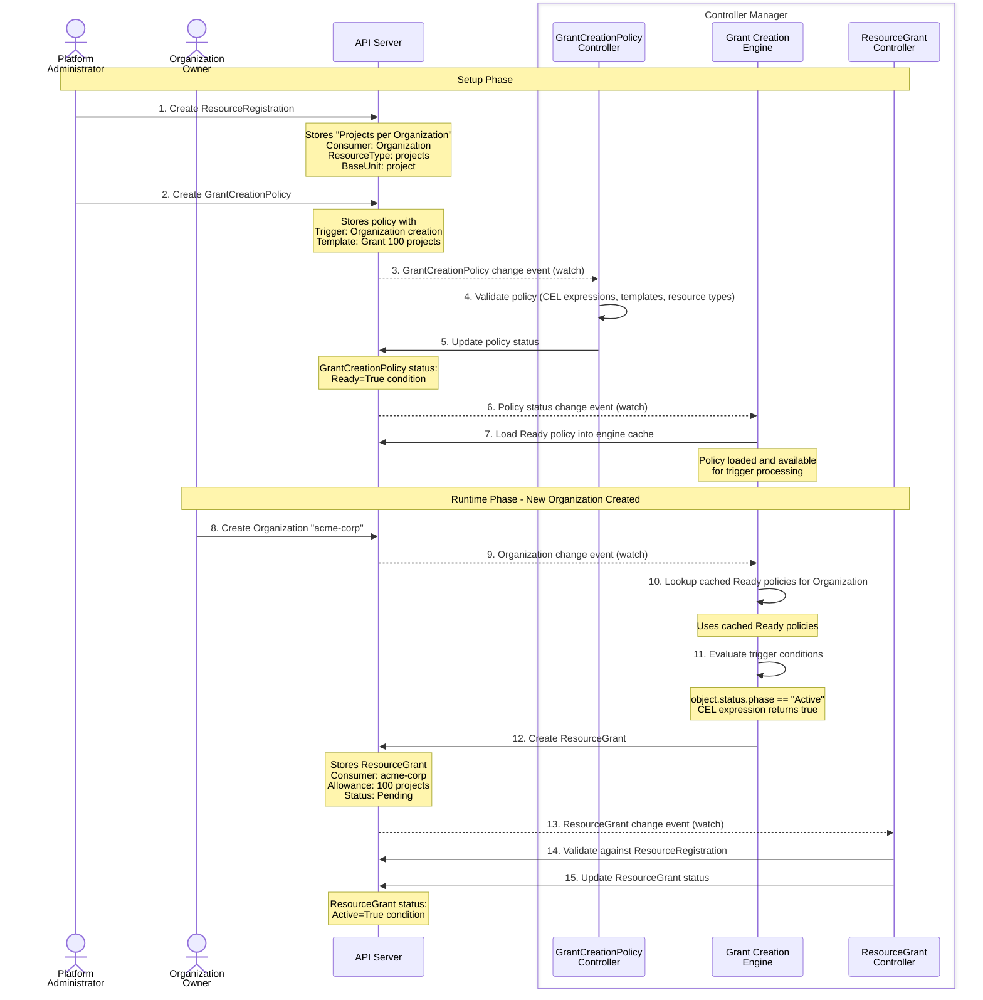
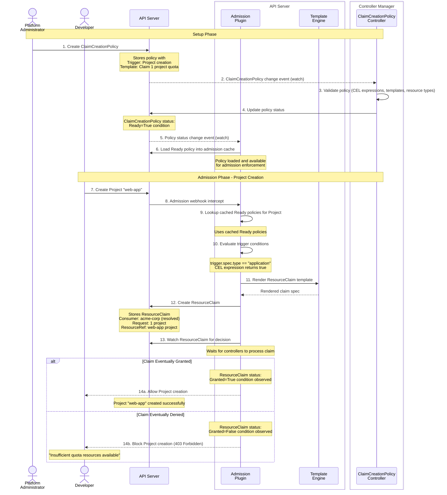
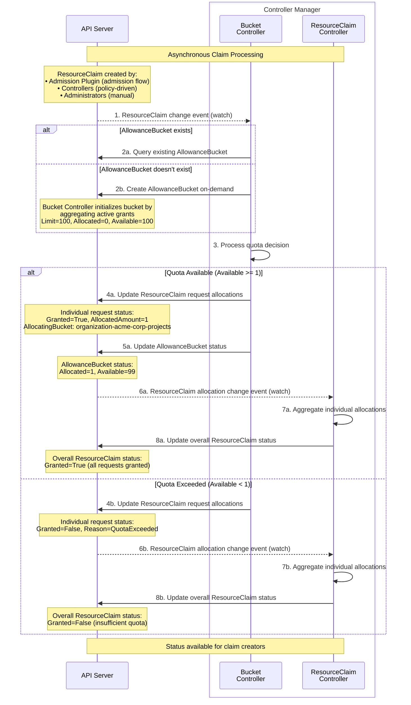

<!-- omit from toc -->
# Milo Quota System Architecture

- [System Overview](#system-overview)
  - [Purpose](#purpose)
  - [Design Principles](#design-principles)
  - [Key Components](#key-components)
  - [Runtime Architecture](#runtime-architecture)
- [Core Concepts](#core-concepts)
  - [ResourceRegistration](#resourceregistration)
  - [ResourceGrant](#resourcegrant)
  - [AllowanceBucket](#allowancebucket)
  - [ResourceClaim](#resourceclaim)
- [Policy Automation](#policy-automation)
  - [GrantCreationPolicy](#grantcreationpolicy)
  - [ClaimCreationPolicy](#claimcreationpolicy)
- [Data Flows](#data-flows)
  - [Quota Provisioning Flow](#quota-provisioning-flow)
  - [Admission Control Flow](#admission-control-flow)
  - [Resource Claiming Flow](#resource-claiming-flow)
- [Resource Cleanup](#resource-cleanup)
- [Integration Summary](#integration-summary)

## System Overview

The Milo quota system provides real-time resource consumption control through a comprehensive framework that automates quota provisioning, enforces limits during resource creation, and maintains accurate usage tracking across distributed deployments.

### Purpose

The quota system enables platform administrators to define resource consumption limits and automatically enforce them without manual intervention. It provides:

- **Real-time Enforcement**: Blocks resource creation when quota limits are exceeded
- **Automated Provisioning**: Dynamically allocates quota based on organizational policies
- **Multi-Resource Support**: Tracks consumption across different resource types
- **Distributed Operation**: Manages quota across multiple Milo deployments
- **Audit Trail**: Maintains complete history of quota decisions and allocations

### Design Principles

- **Declarative Configuration**: All quota rules are defined through API resources, enabling version control and reproducible deployments
- **Event-Driven Architecture**: Components react to resource lifecycle events, ensuring quota decisions reflect real-time system state
- **Separation of Concerns**: Clear boundaries between quota allocation (grants), consumption (claims), and enforcement (admission control)
- **Controller-Based**: Uses reconciliation loops to maintain desired state and handle eventual consistency

### Key Components

The quota system consists of four main component types that work together:

- **Configuration**: ResourceRegistration defines which resource types can be tracked and consumed by which entity types
- **Automation**: GrantCreationPolicy and ClaimCreationPolicy automate quota allocation and enforcement based on resource lifecycle events
- **Resources**: ResourceGrant allocates quota capacity, ResourceClaim requests quota consumption, and AllowanceBucket aggregates real-time availability
- **Runtime**: Controllers coordinate between resources and admission webhooks enforce quota decisions during resource creation

### Runtime Architecture

The quota system uses an event-driven architecture built on informers, which provide efficient resource watching and caching:

**Informers and Watches**:
- Controllers use informers to watch API resources for changes (create, update, delete events)
- Each informer maintains a local cache that's automatically kept in sync with the API server
- Controllers react to events from informers rather than polling the API server
- Multiple controllers can share informers to reduce API server load and memory usage

**Key Informer Usage Patterns**:

*Controller Watches*:
- AllowanceBucket Controller watches ResourceGrants and ResourceClaims to maintain aggregated quota state
- ResourceGrant Controller watches ResourceRegistrations to validate grant configurations
- Policy controllers watch trigger resources dynamically based on policy specifications
- All controllers use predicate filters to ignore irrelevant events

*Admission Plugin Components*:
- **ClaimWatchManager**: Maintains informers for ResourceClaims to track quota decisions
  - Creates temporary watches when admission requests create ResourceClaims
  - Waits for claim status updates to allow/deny resource creation
  - Cleans up watches after decisions are made or timeouts occur
- **Policy Engine**: Caches ClaimCreationPolicies using informers for fast lookup during admission

*Shared Components*:
- **ResourceTypeValidator**: Uses informers to maintain a cache of all registered resource types
  - Shared across controllers and admission plugin to validate resource references
  - Asynchronously initialized to prevent startup blocking
  - Provides efficient type checking without API calls
- **Grant Creation Engine**: Watches resources specified in GrantCreationPolicies
  - Dynamically creates informers based on policy trigger specifications
  - Evaluates CEL expressions against cached resources

This informer-based architecture ensures the quota system can handle high-scale operations with minimal API server load while maintaining real-time responsiveness.

## Core Concepts

### ResourceRegistration

Defines which resource types can be tracked and establishes relationships between consumers and resources.

```yaml
apiVersion: quota.miloapis.com/v1alpha1
kind: ResourceRegistration
metadata:
  name: projects-per-organization
spec:
  consumerTypeRef:
    apiGroup: resourcemanager.miloapis.com
    kind: Organization
  type: Entity
  resourceType: resourcemanager.miloapis.com/projects
  baseUnit: project
  claimingResources:
  - apiGroup: resourcemanager.miloapis.com
    kind: Project
```

**Key Responsibilities:**
- Resource type identity and measurement specifications
- Consumer relationship definitions (Organizations consume Project quota)
- Authorization for which resources can create claims

### ResourceGrant

Allocates concrete quota capacity to specific consumers. Multiple grants for the same consumer and resource type are automatically aggregated.

```yaml
apiVersion: quota.miloapis.com/v1alpha1
kind: ResourceGrant
metadata:
  name: acme-corp-project-quota
spec:
  consumerRef:
    apiGroup: resourcemanager.miloapis.com
    kind: Organization
    name: acme-corp
  allowances:
  - resourceType: resourcemanager.miloapis.com/projects
    buckets:
    - amount: 50
```

**Key Responsibilities:**
- Capacity allocation to consumers
- Multi-resource support in single grants
- Source attribution for billing and reporting

### AllowanceBucket

Central aggregation point that combines quota capacity from ResourceGrants and tracks consumption from ResourceClaims, providing real-time availability calculations.

**Status Example:**
```yaml
status:
  limit: 100        # From active ResourceGrants
  allocated: 25     # From granted ResourceClaims
  available: 75     # limit - allocated
  contributingGrantRefs:
  - name: basic-quota-grant
    amount: 50
  - name: bonus-quota-grant
    amount: 50
```

**Key Responsibilities:**
- Aggregates capacity from all active ResourceGrants
- Tracks consumption from all granted ResourceClaims
- Provides Available = Limit - Allocated for admission decisions
- Created on-demand when first referenced

### ResourceClaim

Requests quota allocation during resource creation, linking to triggering resources for lifecycle management.

```yaml
apiVersion: quota.miloapis.com/v1alpha1
kind: ResourceClaim
metadata:
  name: web-app-project-claim-abc123
spec:
  consumerRef:
    apiGroup: resourcemanager.miloapis.com
    kind: Organization
    name: acme-corp
  requests:
  - resourceType: resourcemanager.miloapis.com/projects
    amount: 1
  resourceRef:
    apiGroup: resourcemanager.miloapis.com
    kind: Project
    name: web-app-project
```

**Key Responsibilities:**
- Quota requests during resource creation
- Consumer identification and resource linking
- Atomic all-or-nothing allocation for multi-resource requests

## Policy Automation

### GrantCreationPolicy

Automates ResourceGrant creation based on resource lifecycle events, eliminating manual quota provisioning.

```yaml
apiVersion: quota.miloapis.com/v1alpha1
kind: GrantCreationPolicy
metadata:
  name: organization-project-quota
spec:
  trigger:
    resource:
      apiVersion: resourcemanager.miloapis.com/v1alpha1
      kind: Organization
    conditions:
    - expression: 'object.status.phase == "Active"'
  target:
    resourceGrantTemplate:
      spec:
        consumerRef:
          apiGroup: resourcemanager.miloapis.com
          kind: Organization
          name: '{{.trigger.metadata.name}}'
        allowances:
        - resourceType: resourcemanager.miloapis.com/projects
          buckets:
          - amount: 50
```

**Capabilities:**
- Watches any Kubernetes resource type for changes
- CEL expressions for flexible trigger conditions
- Go template rendering with resource context
- Cross-cluster grant creation via parent context resolution

### ClaimCreationPolicy

Automates ResourceClaim creation during admission control, providing real-time quota enforcement.

```yaml
apiVersion: quota.miloapis.com/v1alpha1
kind: ClaimCreationPolicy
metadata:
  name: project-quota-enforcement
spec:
  trigger:
    resource:
      apiVersion: resourcemanager.miloapis.com/v1alpha1
      kind: Project
    conditions:
    - expression: 'trigger.spec.type == "application"'
  target:
    resourceClaimTemplate:
      spec:
        consumerRef:
          # Resolved via parent context resolution
          apiGroup: resourcemanager.miloapis.com
          kind: Organization
          name: '{{.parentOrg}}'
        requests:
        - resourceType: resourcemanager.miloapis.com/projects
          amount: 1
```

**Capabilities:**
- Integrates with Kubernetes admission controller framework
- Creates claims during resource creation requests
- Blocks resource creation when quota is exceeded
- Automatic consumer resolution via parent context

## Data Flows

### Quota Provisioning Flow

This flow shows how quota capacity is automatically allocated when new consumers are created in the system.



**Key Points:**
- Trigger evaluation: Grant Creation Engine watches for resource changes and evaluates CEL expressions
- Template rendering: Grant templates use context from triggering resources
- Validation: ResourceGrants are validated against ResourceRegistrations
- Bucket creation: AllowanceBuckets are created on-demand when first ResourceClaim references them

### Admission Control Flow

This flow shows how the admission webhook intercepts resource creation and generates ResourceClaims for quota evaluation.



**Key Points:**
- Synchronous admission: The webhook blocks resource creation until ResourceClaim is processed
- Policy lookup: Admission plugin maintains indexed ClaimCreationPolicies for fast lookup
- Template context: Claim templates access triggering resource, user context, and request information
- Watch pattern: Admission plugin waits for ResourceClaim status updates via shared informers

### Resource Claiming Flow

This flow shows how controllers asynchronously process ResourceClaims to make quota decisions and update bucket allocations.



**Key Points:**
- Asynchronous processing: Controllers process ResourceClaims independently of admission
- On-demand bucket creation: AllowanceBuckets created when first ResourceClaim references them
- Atomic decisions: All requests within a ResourceClaim must be satisfied, or entire claim is denied
- Controller separation: Bucket Controller makes quota decisions, ResourceClaim Controller aggregates results

## Resource Cleanup

When resources are deleted, the quota system automatically reclaims allocated quota through owner references and garbage collection:

**ResourceClaim Cleanup**:
- ResourceClaims include owner references to their triggering resources (e.g., Project)
- When the triggering resource is deleted, the system automatically deletes the ResourceClaim
- Bucket Controller detects ResourceClaim deletion and updates AllowanceBucket allocated amounts
- Quota capacity becomes available for new claims immediately

**ResourceGrant Cleanup**:
- Policy-created ResourceGrants are cleaned up when their trigger resources are deleted
- Manual ResourceGrants persist until explicitly deleted by administrators
- When ResourceGrants are deleted, Bucket Controller recalculates AllowanceBucket limits
- Any ResourceClaims that exceed the new reduced limits are marked as denied

**AllowanceBucket Cleanup**:
- AllowanceBuckets are automatically deleted when no active ResourceGrants or ResourceClaims reference them
- This prevents resource accumulation and maintains a clean quota state

The cleanup process ensures quota capacity is immediately reclaimed without manual intervention, maintaining accurate quota availability for future resource creation requests.

## Integration Summary

The quota system is a core component of Milo that manages resource consumption across the platform:

**Milo Resources**:
- Manages quota for Organizations, Projects, Users, and other Milo resources
- Integrates with Milo's identity and access management for authorization decisions
- Supports distributed deployments through parent context resolution
- Provides comprehensive audit trails for compliance and billing

**Runtime Components**:
- Controllers maintain desired state through reconciliation loops
- Admission webhooks provide real-time enforcement during resource creation
- Owner references enable automatic cleanup when resources are deleted
- Status conditions track resource state and enable observability

**Policy Framework**:
- CEL expressions enable flexible trigger conditions and business logic
- Go templates provide dynamic resource generation with full context access
- Event-driven architecture ensures real-time response to resource lifecycle changes
- Policies can span multiple deployments for centralized quota management

This architecture provides a comprehensive, scalable quota management system
that handles both automated provisioning and real-time enforcement while
maintaining clear separation of concerns between components.
