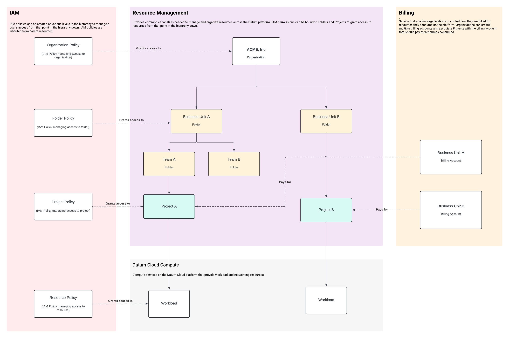

# Resource Hierarchy

Milo organizes business operations through a three-tier resource hierarchy that
maps directly to real-world business structures. This hierarchy enables secure
multi-tenant operations while providing the flexibility to organize resources in
ways that match your business needs.

Milo's resource hierarchy is designed to scale from simple hobbyist users to
large organizations with complex organizational structures.

## Why This Hierarchy Matters

The three-tier structure solves common challenges in multi-tenant business
operations:

```
Organization (Top-level tenant)
├── Projects (Resource grouping)
│   └── Business Resources (Applications, services, data)
└── Users & Access Control (IAM resources)
```

**Organizations** provide complete tenant isolation, ensuring each of your
consumers operates in their own secure environment without interfering with
others.

**Projects** enable logical organization within each tenant, allowing you to
separate environments, teams, or services while maintaining the security
boundary.

**Flexible access control** works across all levels, so you can grant
permissions at the organization level, project level, or for specific resources
as needed.

Here's an example of how a complex organizational structure can be represented
with a platform like Milo.



## Organizations

Organizations represent the top-level tenant boundary in Milo, typically mapping
to a single consumer or business entity that uses your services. Consumers are
expected to use a single Organization to manage and organize their resources.

### Organization Types

Organizations support two immutable types:

- **Personal**: Individual consumers or small operations
- **Standard**: Business consumers requiring team collaboration and advanced
  features

The organization type cannot be changed after creation and determines default
available features and resource limits.

## Projects

Projects provide the second tier of resource organization, enabling logical
grouping of related resources within an organization. Projects are
cluster-scoped resources that belong to exactly one organization. Every project
is provided an isolated control plane with namespaces to enable full control for
users to organize resources based on their needs.

### Project Use Cases

Common project patterns include:

- **Environment separation**: Development, staging, and production projects
- **Service boundaries**: Separate projects for different microservices or
  applications
- **Team organization**: Projects aligned with development teams or business
  units
- **Consumer segmentation**: B2B service providers creating projects per their
  own consumers

### Access Control Inheritance

Projects inherit organizational context while enabling project-specific
permissions:

- Project creators automatically receive owner permissions
- Organization members can be granted project-specific roles
- Cross-project access requires explicit permission grants

## Folders

> [!NOTE]
>
> Folders don't exist within Milo today, but we anticipate them being a need in
> the future to provide complex organizations the ability to organize their
> resources and grant access to multiple projects managed by the same team.

When supported, Folders will provide another level of organization that enables
complex organizations to organize related projects into a nested hierarchy of
Folders to manage access across all projects in a folder.

Organizational admins will be able to assign roles to users and machine accounts
at a folder and their access will be inherited to all folders or projects within
the folder.

## Multi-Tenancy and Security

Milo's hierarchy provides complete isolation between organizations while
enabling flexible resource sharing within each organization:

- **Organization boundaries**: Each organization operates in complete isolation
  from others
- **Project separation**: Projects within an organization can share access while
  maintaining logical separation
- **Access control**: Users and permissions can be scoped to the appropriate
  level of your business structure

Read more about how Milo achieves multi-tenancy by reviewing the [Multi-tenancy
architecture](../developer-guides/architecture/control-plane/multi-tenancy.md)
documentation.
