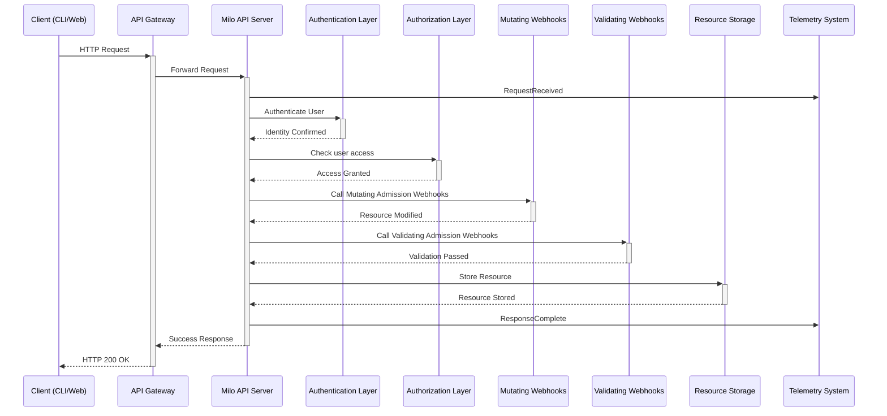

# Milo API Server

The Milo API server is the control plane component responsible for handling all
requests for resources and services registered with Milo, ensuring all requests
are authorized, validated, and audited for security and compliance. Control
plane components can leverage the API server to receive an event stream of
events happening to resources they care about so they can react in near
real-time.

The API is fully extensible through custom resources and apiserver aggregation.

## Request Processing Pipeline

Every request to the Milo control plane flows through a comprehensive processing
pipeline that ensures security, validation, and compliance. This pipeline
leverages the Kubernetes API server's battle-tested request handling while
adding business-specific logic for multi-tenant operations.

### Authentication

The control plane will authenticate all requests that attempt to access APIs
available from Milo's API server. The API server supports resolving
authentication through several methods.

- **External Identity Providers**: Integration with OIDC-compliant providers
  like Zitadel, Auth0, or other enterprise identity systems
- **Webhook based Token Verification**: Leverages a webhook to resolve
  authentication tokens to authenticated user information
- **Client Certificates**: Standard x509 certificate-based authentication for
  administrative access

Authentication determines the identity making the request, establishing the
foundation for all subsequent authorization and audit decisions. Refer to the
[authentication documentation](../../authentication/) for more information on
when to choose each option.

Most service providers will be able to leverage the authentication providers
available with Milo to handle authentication.

### Authorization

After a request has been authenticated, the control plane with authorize the
request to ensure the authenticated user has access to the resource they're
requesting. The authorization system uses fine-grained access control with
resource relationships and organization hierarchies to resolve an authenticated
user's access to resources.

Service providers can leverage authorization providers available with Milo to
implement fine-grained authorization using the IAM resources available with
Milo. Service providers can also fully customize Milo's authorization with their
own authorization by using an [authorization webhook] to permit or deny access
to resources.

[authorization webhook]:
    https://kubernetes.io/docs/reference/access-authn-authz/webhook/

<!-- TODO: Link off to documentation around building a new authorization webhook -->

### Admission Control

Requests that are authorized, will be processed next by the admission control
layer of the API. The admission control layer is responsible for evaluating and
executing mutating webhooks, validating webhooks, and validating policies
against the resource before the resource is stored.

Refer to the [Admission Control](#admission-control-through-webhooks--policies)
section for more information.

### Storage

Once a request has made it through all the stages of the requires pipeline, the
APIServer will the serialized state of all objects in an [etcd] cluster. We may
evaluate other storage backends in the future.

[etcd]: https://etcd.io

### Audit Logging

Milo's control plane supports configuring how the control plane should send
audit logs for events happening to resources in the control plane through an
audit policy config. The audit log policy instructs the API server on how to
handle audit logs based on resource attributes, user attributes, or other
information.

Milo supports the same audit log configuration that's supported by Kubernetes.
For more information on available options, refer to the [Kubernetes auditing]
documentation.

[Kubernetes auditing]:
    https://kubernetes.io/docs/tasks/debug/debug-cluster/audit/

## Deployment

Deployment manifests are available under
[`config/apiserver/`](../../../../config/apiserver/) to deploy the API server to
a Kubernetes cluster.

## Telemetry

### Metrics

The API server exports detailed metrics that can be used to understand the
behavior and performance of the APIserver. Refer to the [API server metrics in
the Kubernetes][apiserver-metrics] documentation.

[apiserver-metrics]:
    https://kubernetes.io/docs/reference/instrumentation/metrics/

### Audit Logs

The API supports exporting audit logs to the filesystem or to an HTTP endpoint.
Refer to the [Kubernetes Auditing] documentation for more information.

## Additional Context

- [Control Plane Architecture](./README.md)
- [Kubernetes apiserver Library](https://github.com/kubernetes/apiserver)
- [KEP 4080 - Generic Control
  Plane](https://github.com/kubernetes/enhancements/tree/master/keps/sig-api-machinery/4080-generic-controlplane)
