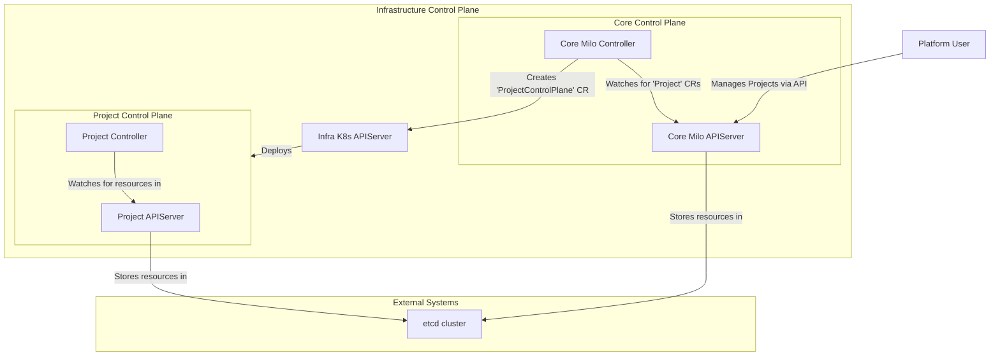
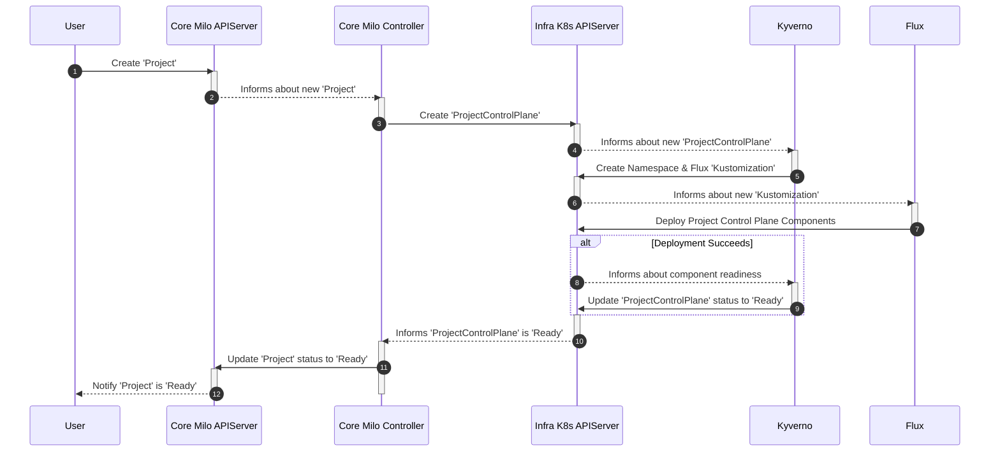

# Multi Tenant Control Plane

Milo includes a multi-tenant control plane platform that provides isolated
control planes for projects created in Milo to provide isolation on service
delivery. The deployment and management of individual project control planes is
orchestrated using [FluxCD] for GitOps and [Kyverno] for policy-driven
automation.

[FluxCD]: https://fluxcd.io
[Kyverno]: https://kyverno.io

> [!IMPORTANT]
>
> This architecture provides isolation by deploying separate components for each
> project. This approach is required because the Milo apiserver is not currently
> multi-tenant capable by itself. We plan to invest in the Milo apiserver and
> other components in the future to make it fully multi-tenant capable so a
> single apiserver can serve multiple projects while remaining isolated.

## Architecture Overview

This diagram provides a high-level overview of the system's architecture,
focusing on the containers that are deployed and their primary dependencies.

## Component Responsibilities

### Core Control Plane

The core control plane is responsible for managing a service provider's
platform. Service providers leverage the core control plane to manage
organizations, users, and projects across the platform.

Namespaces exist in the core control plane to provide isolation between
organizations and administrative resources available to service providers. The
following namespaces are expected to exist in the core control plane.

- **kube-system** - can't be removed because some controller manager components
  depend on this namespace existing
- **default** this namespace is not used
- **kube-public** and **kube-system** is an internal namespace that can't be
  removed due to controller manager expectations
- **milo-system** is the system namespace for managing the Milo platform
- **organization-*** contains all resources related to an organization. this
  namespaces

Consumers can query their organizational resources through the organization
context to ensure their requests are properly authorized. The organization
context information in passed through the authorization context so it can be
leveraged in authorization queries.

<!-- TODO: Create documentation for how to query the API through the organizational context -->

Users also manage their projects in the core control plane. Every project is
provisioned it's own control plane to provide full tenancy isolation.

The core control plane is built around the following infrastructure components:

- **Milo APIServer**: Core apiserver that manages the core platform and
  organizational resources. Consumers interact with this control plane to manage
  their organizations and projects.
- **Milo Controller Manager**: Provides controllers responsible for Milo's core
  business logic for service provider and organizational level resources. This
  component is also responsible for helping orchestrate the deployment of
  project control planes with Kyverno.
- **Kyverno**: Kyverno policies are used to trigger the deployment of control
  plane components for each project. Kyverno orchestrates the deployment with
  FluxCD.
- **Flux**: FluxCD is responsible for deploying and configuring each of the
  control plane components using Kustomize.

### Project Control Plane

The project control plane operates at the service delivery level and manages
individual consumer workspaces. Projects are how users consume services from
service providers and how service providers can control how many resources
consumers can use in their projects.

Projects also provide tenancy isolation between other projects and
organizations. Project admins can leverage Kubernetes RBAC policies to manage
individual access to resources within the project.

Services operating in the project can leverage the control plane to integrate
with each other.

- **Milo apiserver**: Manages all requests and access to resources for the APIs
  registered with the project.
- **Controller Manager**: A dedicated controller manager providing core business
  logic and control plane capabilities.

## Orchestration with Flux and Kyverno

The power of this system comes from the interplay between Milo, Kyverno, and
Flux. This approach gives us the ability to leverage all of the Kustomize
manifests in each of the repos to deploy the software components and drive
deployment of the control plane through policies.

### Project Creation Workflow

- **Trigger**: A user creates a `Project` resource in the core Milo APIServer.
  The Milo Controller Manager observes this new project and creates a
  corresponding `ProjectControlPlane` custom resource in the infrastructure
  control plane.
- **Namespace Generation**: A Kyverno policy sees the new `ProjectControlPlane`
  and creates a corresponding `project-{uid}` namespace.
- **Flux Kustomization Generation**: Another Kyverno policy sees the new
  namespace and generates a Flux `Kustomization` resource within it.
- **Flux Deployment**: Flux detects the new `Kustomization` resource and
  proceeds to deploy the resources defined in the
  `project-control-plane-deployment` path. This includes the project-specific
  APIServer and Controller Manager.
- **Kubeconfig Generation**: A policy for kubeconfig generation sees the
  certificate secrets created for the new control plane and generates a
  `kubeconfig` Secret for easy access.

This GitOps + Policy-as-Code approach allows for a fully declarative and
automated way to stamp out new, isolated control planes.
