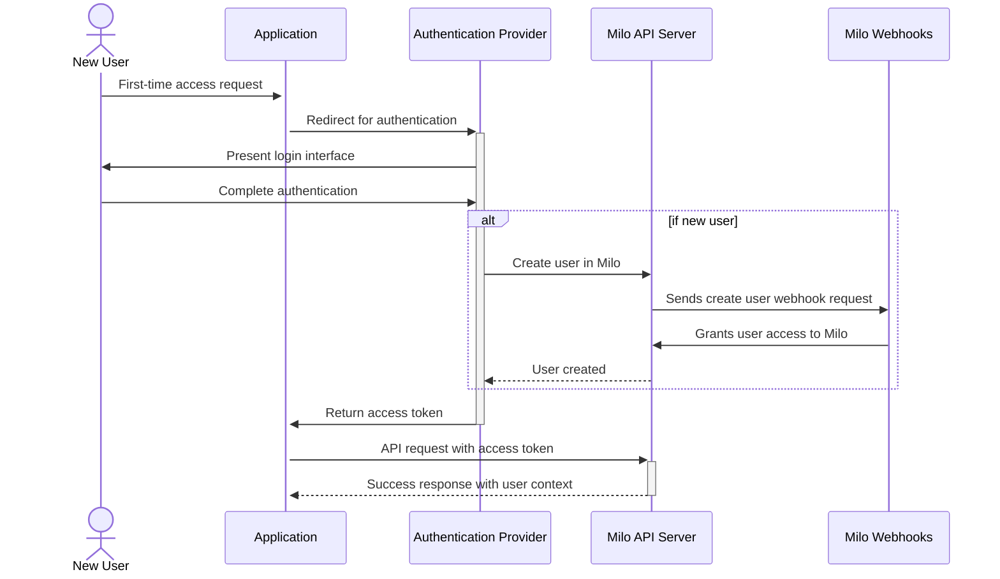

<!-- omit from toc -->
# Identity Platform Architecture

- [Platform Overview](#platform-overview)
- [Core Architecture Components](#core-architecture-components)
  - [Authentication Methods Overview](#authentication-methods-overview)
  - [Identity Resource Management](#identity-resource-management)
  - [External Provider Integration](#external-provider-integration)
- [Identity Lifecycle Management](#identity-lifecycle-management)
  - [User Onboarding Flow](#user-onboarding-flow)
  - [Compliance and Auditing](#compliance-and-auditing)

---

## Platform Overview

The Identity Platform is Milo's comprehensive identity and access management
system that provides secure, scalable identity verification and authorization
for all users and services accessing the platform. The platform works with
external identity providers to handle both human user and machine user
authentication while maintaining fine-grained authorization control through
declarative Kubernetes-style APIs.

## Core Architecture Components

### Authentication Methods Overview

Milo's authentication system is designed with two primary integration paths for
users and organizations, plus a system-level method for service provider
operations:

<!-- omit from toc -->
#### Primary User Authentication Methods

These are the recommended approaches for authenticating end users and
applications that consume Milo services:

1. **OIDC Token Authentication** - The preferred method for modern
   authentication, providing seamless integration with enterprise identity
   providers and single sign-on systems.

2. **Webhook Token Authentication** - The flexible solution for organizations
   with existing authentication systems, custom token formats, or complex
   integration requirements.

<!-- omit from toc -->
#### System-Level Authentication

3. **Client Certificate Authentication** - Primarily used for system components,
   administrative access, and service provider operations requiring
   cryptographic proof of identity.

### Identity Resource Management

The platform manages identity through Kubernetes-style custom resources that
provide declarative configuration and lifecycle management:

- **Users** are automatically created by the platform's authentication provider
  to represent each unique user that accesses the platform. A single human user
  may have multiple identities they use to access the platform.
- **Groups** provide efficient access control by organizing resources with
  similar permission requirements. Groups can represent organizational
  structures, project teams, or functional roles.
- **Roles** define a collection of permissions using the granular
  `{service}/{resource}.{action}` that should be assigned to a subject assigned
  the role.
- **Policy Bindings** connect users, groups, and machine accounts to roles
  within a specific resource context, creating the actual permission grants.
- **Machine Accounts** provide identity for automated systems, services, and
  CI/CD pipelines that need to interact with the Milo platform.

### External Provider Integration

The flexible Identity architecture supported by Milo enables service providers
to choose between authorization providers directly supported by Milo or building
their own integration.

Milo has two primary authentication providers today:

- **Zitadel** for authenticating human and machine users through social identity
  providers, MFA, and Enterprise SSO.
- **OpenFGA** for fine-grained permission access checks with hierarchical
  inheritance.

## Identity Lifecycle Management

### User Onboarding Flow

Authentication providers are expected to automatically create users in Milo as
the access the platform. Users are automatically provided with a default level
of access to the platform that allows them to perform onboarding actions like
creating an organization.

### Compliance and Auditing

The platform provides comprehensive audit capabilities for regulatory
compliance:

- **Authorization Audit**: Detailed records of all permission checks and
  decisions
- **Resource Audit**: Tracking of all identity resource lifecycle events

> [!NOTE]
>
> We plan to support more audit log events in the future to capture all
> authentication requests. If there's any audit events you would like to see
> that aren't being captured today. Create a new GitHub issue with more
> information.

---

The Identity Platform provides the secure foundation that enables Milo to
deliver trusted, scalable business operations while maintaining the flexibility
to integrate with diverse authentication and authorization requirements across
different organizational contexts.
