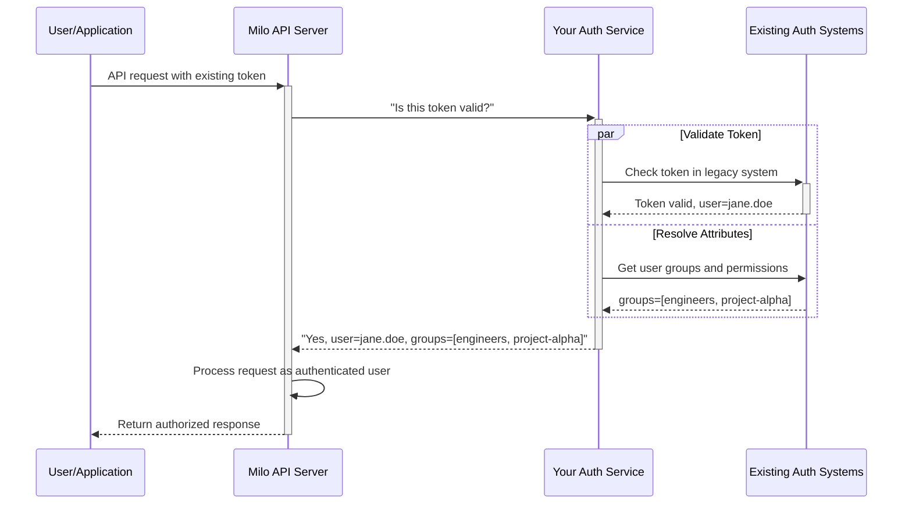
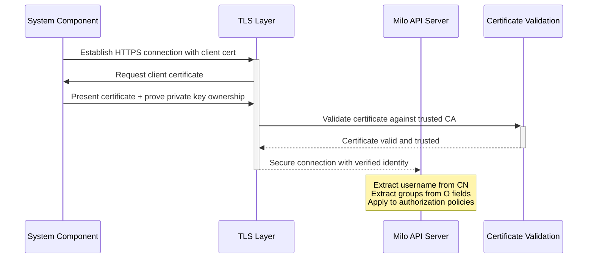

# Authentication with Milo

Authentication is how the Milo API server identifies who or what is making a
request. When someone or something attempts to access Milo's APIs, the first
question the system asks is: "Who are you?" This process of verifying identity
forms the foundation for all authorization decisions and audit trails.

The Milo API server supports three authentication methods designed for different
integration scenarios and operational requirements. Authentication providers can
leverage these options to support building an authentication provider for Milo.

## Authentication Methods Overview

Milo's authentication system is designed with two primary integration paths for
users and organizations, plus a system-level method for service provider
operations:

### Primary User Authentication Methods

These are the recommended approaches for authenticating end users and
applications that consume Milo services:

1. **OIDC Token Authentication** - The preferred method for modern
   authentication, providing seamless integration with enterprise identity
   providers and single sign-on systems.

2. **Webhook Token Authentication** - The flexible solution for organizations
   with existing authentication systems, custom token formats, or complex
   integration requirements.

### System-Level Authentication

3. **Client Certificate Authentication** - Primarily used for system components,
   administrative access, and service provider operations requiring
   cryptographic proof of identity.

## OIDC Token Authentication

OpenID Connect (OIDC) enables organizations to leverage their existing identity
infrastructure while providing users with familiar single sign-on experiences.
The Milo apiserver can be configured to trust JWT's issued by a provider that
supports OIDC.

To learn more about using OIDC authentication with Milo, refer to the Kubernetes
documentation on [authenticating with OpenID connect tokens][k8s-oidc].

[k8s-oidc]:
    https://kubernetes.io/docs/reference/access-authn-authz/authentication/#openid-connect-tokens

### JWT Revocation and Security Considerations

One of the key challenges with JWT tokens is revocation - once issued, JWTs are
typically valid until they expire. This creates security implications when users
need to be immediately disabled.

Unlike session-based authentication where you can invalidate a session on the
server, JWTs are stateless and validated locally by Milo without contacting the
identity provider. This means:

- **Short Token Lifespans**: OIDC ID tokens are typically valid for 15 minutes
  to 1 hour
- **No Central Revocation**: Milo doesn't maintain a token block-list
- **Refresh Token Control**: Identity providers can revoke refresh tokens to
  prevent new token issuance

## Webhook Token Authentication

### The Universal Integration Solution

Webhook authentication is Milo's most flexible authentication method, designed
for organizations that need to integrate existing authentication systems without
major changes. It's the bridge between Milo and virtually any authentication
system, regardless of how old, proprietary, or unique it might be.

Instead of forcing organizations to migrate their authentication systems,
webhook authentication lets you keep using what you have while still securing
access to Milo.

### When Webhooks Are Essential

**Legacy System Integration:** Your organization has invested years in a custom
authentication system with proprietary tokens, complex business logic, and deep
integrations. Webhook authentication lets you preserve this investment while
adding Milo to your ecosystem.

**Complex Authentication Workflows:** Some organizations require multi-step
authentication that involves:
- Initial credential verification
- Risk assessment based on location, device, or behavior
- Dynamic permission calculation from multiple systems
- Real-time compliance or security clearance checks

**Custom Token Formats:** Your existing systems use token formats that don't
conform to standard JWT or certificate structures. Webhook authentication can
validate any token format your systems produce.

**Gradual Migration Scenarios:** You're planning to move to modern
authentication (like OIDC) but need to support existing systems during a
transition period. Webhook authentication can validate both old and new token
types.

### How Webhook Authentication Works



This delegation model means:
- Milo doesn't need to understand your token format
- Your authentication logic stays in your existing systems
- You can add complex validation logic without changing Milo
- Users continue using familiar authentication methods

### The TokenReview Protocol

Webhook authentication uses Kubernetes' standardized TokenReview API. For every
request, Milo sends your webhook service a validation request:

**Request from Milo:**
```json
{
  "apiVersion": "authentication.k8s.io/v1",
  "kind": "TokenReview",
  "spec": {
    "token": "your-existing-token-format",
    "audiences": ["https://milo-api-server:8443"]
  }
}
```

**Your webhook validates the token and responds:**
```json
{
  "apiVersion": "authentication.k8s.io/v1",
  "kind": "TokenReview",
  "status": {
    "authenticated": true,
    "user": {
      "username": "jane.doe",
      "uid": "emp-12345",
      "groups": ["engineers", "project-alpha", "organization:acme-corp"],
      "extra": {
        "department": ["engineering"],
        "clearance-level": ["level-2"],
        "cost-center": ["cc-1000"]
      }
    }
  }
}
```

### Configuration

Configure Milo to use your webhook service:

```bash
milo apiserver \
  --authentication-token-webhook-config-file=/path/to/webhook-config.yaml \
  --authentication-token-webhook-cache-ttl=30s \
  --tls-cert-file=/path/to/server.crt \
  --tls-private-key-file=/path/to/server.key
```

**Webhook configuration file (webhook-config.yaml):**
```yaml
apiVersion: v1
kind: Config
clusters:
- name: auth-webhook
  cluster:
    server: https://auth-service.company.com/validate
    certificate-authority: /etc/ssl/certs/company-ca.pem
users:
- name: milo-client
  user:
    client-certificate: /etc/ssl/certs/milo-client.pem
    client-key: /etc/ssl/private/milo-client-key.pem
contexts:
- name: webhook
  context:
    cluster: auth-webhook
    user: milo-client
current-context: webhook
```

### Real-World Integration Examples

**Example 1: Legacy Database Integration** Your company has user accounts in a
proprietary database with custom session tokens:

```bash
# Users authenticate with existing system and get custom tokens
LEGACY_TOKEN="session_abc123_user456_expires789"

# Your webhook validates against the existing database
# Users can immediately access Milo without learning new authentication
curl -H "Authorization: Bearer $LEGACY_TOKEN" \
  https://milo-api:8443/apis/resourcemanager.miloapis.com/v1alpha1/projects
```

**Example 2: Multi-System Authentication** Your authentication requires checking
multiple systems:

```python
def validate_token(token):
    # Step 1: Validate against primary auth system
    user = primary_auth.validate(token)
    if not user:
        return None

    # Step 2: Check current project assignments
    projects = hr_system.get_active_projects(user.id)

    # Step 3: Verify security clearance
    clearance = security_system.get_clearance(user.id)

    # Step 4: Build combined response
    return {
        "username": user.email,
        "groups": [f"project:{p}" for p in projects] + [f"clearance:{clearance}"],
        "extra": {
            "employee-id": [user.employee_id],
            "department": [user.department]
        }
    }
```

### Performance Considerations

Since webhook authentication adds a network call to every request, optimize for
performance:

**Caching Strategy:**
```bash
# Cache successful validations for short periods
--authentication-token-webhook-cache-ttl=30s
```

**Webhook Service Optimization:**
- Use connection pooling for database connections
- Implement circuit breakers for external dependencies
- Add health checks and monitoring
- Deploy multiple instances for high availability

### Usage Example

Users continue using existing authentication while gaining access to Milo:

```bash
# Users authenticate with your existing system
# They receive tokens in whatever format you currently use
EXISTING_TOKEN="your-current-token-format"

# These tokens now work with Milo APIs
curl -X GET \
  -H "Authorization: Bearer $EXISTING_TOKEN" \
  https://milo-api-server:8443/apis/resourcemanager.miloapis.com/v1alpha1/organizations
```

### When to Choose Webhook Authentication

**✅ Perfect for:**
- Organizations with significant investment in existing authentication systems
- Complex authentication requirements that involve multiple systems
- Custom token formats that can't be easily changed
- Gradual migration scenarios
- Dynamic user attribute resolution needs

**❌ Consider alternatives for:**
- Simple authentication needs (OIDC might be easier)
- High-performance scenarios sensitive to network latency
- Teams without development resources to build webhook services
- Air-gapped environments (if webhook can't reach auth systems)

For detailed webhook implementation guidance, see our [Webhook Authentication
Implementation Guide](./webhook-implementation.md) and the [Kubernetes Webhook
Token Authentication
documentation](https://kubernetes.io/docs/reference/access-authn-authz/authentication/#webhook-token-authentication).

## Client Certificate Authentication

### System-Level Cryptographic Identity

Client certificate authentication provides the strongest form of cryptographic
identity verification available in Milo. Unlike password-based systems or tokens
that can be intercepted, client certificates provide mathematical proof of
identity that cannot be forged or replayed.

This method is primarily designed for system-level authentication - the
components, services, and administrative functions that service providers use to
operate and manage Milo deployments.

### Understanding Cryptographic Proof

When you present a client certificate, you're not just claiming an identity -
you're providing cryptographic proof that you possess a private key
corresponding to a certificate signed by a trusted authority. This creates
several security advantages:

- **Non-repudiation**: Actions cannot be denied since they require the private
  key
- **Offline verification**: No network calls to external systems required
- **Tamper evidence**: Any modification to the certificate invalidates the
  signature
- **Perfect forward secrecy**: Compromising current keys doesn't compromise past
  communications

### The Certificate Trust Model

Client certificates operate on a hierarchical trust model where a Certificate
Authority (CA) acts as the root of trust:

```
Service Provider Root CA
├── Operations Team Certificates
│   ├── Admin Certificate (Alice)
│   ├── Admin Certificate (Bob)
│   └── Emergency Access Certificate
├── System Component Certificates
│   ├── Controller Manager Certificate
│   ├── Webhook Service Certificate
│   └── Monitoring System Certificate
└── Automation Certificates
    ├── Backup Service Certificate
    ├── CI/CD Pipeline Certificate
    └── Log Aggregation Certificate
```

### When Client Certificates Are Essential

**Administrative and Emergency Access:** System administrators need access
that's independent of external systems. If your identity provider fails, you
still need to manage your infrastructure. Client certificates provide this
reliability because they work entirely offline.

**System Component Authentication:** Services that make up your Milo deployment
need to authenticate with each other:
- Controller managers reconciling resources
- Webhook services validating admission policies
- Monitoring systems collecting metrics
- Backup services accessing data

**Long-Running Automation:** Automated processes that run for months without
human intervention:
- Scheduled backup jobs
- Compliance reporting systems
- Resource cleanup automation
- Health monitoring services

**High-Security Environments:** Scenarios requiring cryptographic proof of
identity:
- Financial services with regulatory requirements
- Government systems with security clearance needs
- Healthcare systems handling protected information
- Air-gapped environments without internet connectivity

### Certificate Identity Mapping

Milo extracts identity information from specific X.509 certificate fields:

**Common Name (CN) - Username:**
```
CN=backup-service
```
Becomes the username `backup-service`

**Organization (O) Fields - Group Memberships:**
```
O=system:automation
O=cluster:production
O=service:backup
```
Results in groups: `system:automation`, `cluster:production`, `service:backup`

**Complete Example:**
```
Subject: CN=prod-controller-manager,O=system:controllers,O=cluster:production,O=component:core
```
Identity:
- **Username**: `prod-controller-manager`
- **Groups**: `system:controllers`, `cluster:production`, `component:core`

### Authentication Flow



Authentication happens at the TLS layer, providing excellent performance and
security guarantees.

### Configuration

Configure Milo to trust your certificate authority:

```bash
milo apiserver \
  --client-ca-file=/etc/ssl/certs/service-provider-ca.crt \
  --tls-cert-file=/etc/ssl/certs/milo-server.crt \
  --tls-private-key-file=/etc/ssl/private/milo-server.key
```

### Certificate Generation for System Components

**1. Create Certificate Authority (one-time setup):**
```bash
# Generate CA private key
openssl genrsa -out service-provider-ca.key 4096

# Generate CA certificate
openssl req -new -x509 -key service-provider-ca.key -sha256 \
  -subj "/C=US/O=YourCompany/CN=Service-Provider-CA" \
  -days 3650 -out service-provider-ca.crt
```

**2. Generate system component certificates:**
```bash
# Controller manager certificate
openssl genrsa -out controller-manager.key 2048
openssl req -new -key controller-manager.key \
  -subj "/CN=controller-manager/O=system:controllers/O=cluster:production" \
  -out controller-manager.csr
openssl x509 -req -in controller-manager.csr \
  -CA service-provider-ca.crt -CAkey service-provider-ca.key \
  -out controller-manager.crt -days 365 -sha256

# Webhook service certificate
openssl genrsa -out webhook-service.key 2048
openssl req -new -key webhook-service.key \
  -subj "/CN=webhook-service/O=system:webhooks/O=cluster:production" \
  -out webhook-service.csr
openssl x509 -req -in webhook-service.csr \
  -CA service-provider-ca.crt -CAkey service-provider-ca.key \
  -out webhook-service.crt -days 365 -sha256
```

### Usage Examples

**System component accessing Milo:**
```bash
# Controller manager making API calls
curl -X GET \
  --cert controller-manager.crt \
  --key controller-manager.key \
  --cacert service-provider-ca.crt \
  https://milo-api-server:8443/apis/resourcemanager.miloapis.com/v1alpha1/projects
```

**Administrative emergency access:**
```bash
# Admin accessing Milo when identity provider is down
curl -X GET \
  --cert admin-emergency.crt \
  --key admin-emergency.key \
  --cacert service-provider-ca.crt \
  https://milo-api-server:8443/apis/resourcemanager.miloapis.com/v1alpha1/organizations
```

### Certificate Lifecycle Management

**Security Best Practices:**
- Generate certificates with appropriate lifespans (1 year for most components)
- Use strong key sizes (2048-bit minimum, 4096-bit for CAs)
- Store private keys securely (encrypted filesystems, HSMs for production)
- Implement certificate rotation procedures
- Monitor certificate expiration dates

**Operational Procedures:**
- Maintain certificate inventory
- Set up expiration monitoring and alerting
- Establish emergency certificate issuance procedures
- Document certificate recovery processes
- Regular security audits of certificate usage

### When to Choose Client Certificates

**✅ Essential for:**
- System component authentication (controllers, webhooks, services)
- Administrative emergency access
- Air-gapped environments
- High-security scenarios requiring cryptographic proof
- Long-running automation systems
- Compliance requirements for non-repudiation

**❌ Not suitable for:**
- End-user authentication (too complex for most users)
- Web applications (browser certificate UX is poor)
- Large-scale user management (distribution complexity)
- Organizations without PKI expertise

For comprehensive certificate management guidance, see the [X.509 Certificate
Standards](https://tools.ietf.org/html/rfc5280) and [NIST PKI
Guidelines](https://csrc.nist.gov/projects/pki).
