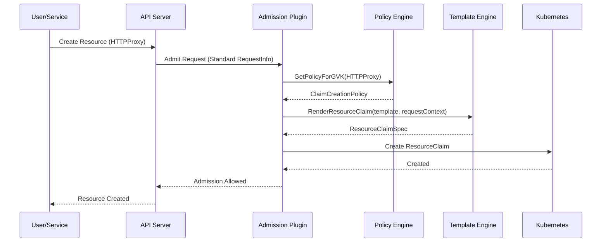
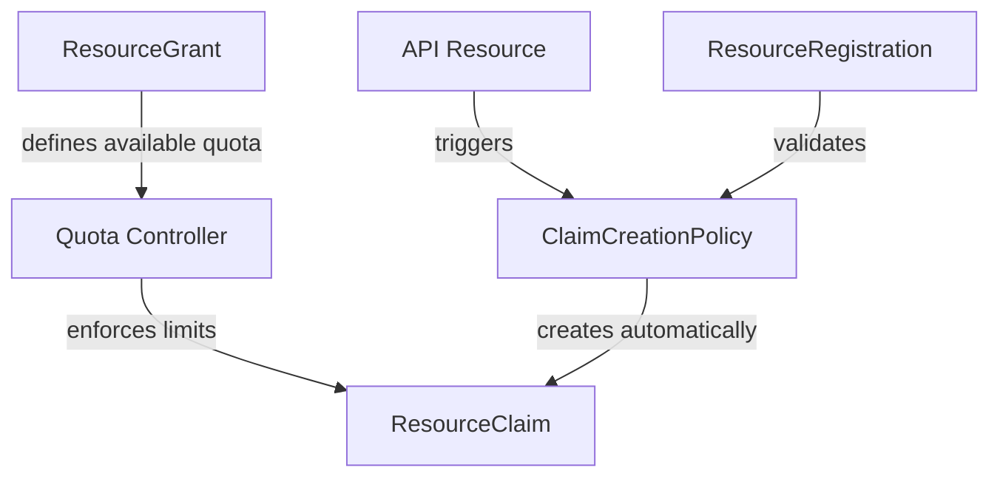

<!-- omit from toc -->
# ClaimCreationPolicy Enhancement: Policy-Driven ResourceClaim Creation

**Status:** Proposed
**Authors:** Milo Engineering Team
**Created:** 2025-01-08
**Updated:** 2025-01-10

<!-- omit from toc -->
## Table of Contents

- [Executive Summary](#executive-summary)
  - [Problem Statement](#problem-statement)
  - [Proposed Solution](#proposed-solution)
  - [Key Benefits](#key-benefits)
- [Background and Motivation](#background-and-motivation)
  - [Current State: Manual Quota Management](#current-state-manual-quota-management)
  - [Service Provider and Platform Administrator Requirements](#service-provider-and-platform-administrator-requirements)
  - [Opportunity for Automation](#opportunity-for-automation)
- [Goals and Non-Goals](#goals-and-non-goals)
  - [Goals](#goals)
  - [Non-Goals](#non-goals)
- [System Design](#system-design)
  - [Architecture Overview](#architecture-overview)
  - [API Design](#api-design)
    - [ClaimCreationPolicy CRD Specification](#claimcreationpolicy-crd-specification)
    - [CEL Expression Context](#cel-expression-context)
    - [Go Template Variables (nameTemplate only)](#go-template-variables-nametemplate-only)
    - [Field Suffix Pattern for CEL Expressions](#field-suffix-pattern-for-cel-expressions)
    - [ResourceRegistration Validation](#resourceregistration-validation)
  - [Sample Configurations](#sample-configurations)
    - [1. Basic HTTPProxy Policy (Static Values)](#1-basic-httpproxy-policy-static-values)
    - [2. Service Tier Policy with CEL Expressions](#2-service-tier-policy-with-cel-expressions)
    - [3. Multi-Request Policy with Complex CEL Logic](#3-multi-request-policy-with-complex-cel-logic)
    - [4. High-Consumption Resource Policy with Dynamic Scaling](#4-high-consumption-resource-policy-with-dynamic-scaling)
    - [5. Service Policy with Dynamic Dimensions](#5-service-policy-with-dynamic-dimensions)
  - [Core Components](#core-components)
    - [1. ClaimCreationPolicy CRD](#1-claimcreationpolicy-crd)
    - [2. Policy Engine](#2-policy-engine)
    - [3. Template Engine](#3-template-engine)
    - [4. Admission Plugin Integration](#4-admission-plugin-integration)
- [Implementation Details](#implementation-details)
  - [Admission Plugin Implementation](#admission-plugin-implementation)
    - [Plugin Registration and Setup](#plugin-registration-and-setup)
    - [Request Processing Flow](#request-processing-flow)
    - [Error Handling Strategy](#error-handling-strategy)
  - [Controller Implementation](#controller-implementation)
    - [ClaimCreationPolicy Controller](#claimcreationpolicy-controller)
    - [PolicyEngine Implementation](#policyengine-implementation)
  - [Performance Considerations](#performance-considerations)
    - [Built-in Admission Plugin Performance Benefits](#built-in-admission-plugin-performance-benefits)
    - [Optimization Strategies](#optimization-strategies)
- [Operations](#operations)
  - [Deployment and Configuration](#deployment-and-configuration)
    - [API Server Integration](#api-server-integration)
    - [Controller Manager Integration](#controller-manager-integration)
    - [Policy Deployment and Management](#policy-deployment-and-management)
  - [Monitoring and Troubleshooting](#monitoring-and-troubleshooting)
    - [Monitoring and Observability](#monitoring-and-observability)
    - [Troubleshooting Guidance](#troubleshooting-guidance)
  - [Security and Multi-tenancy](#security-and-multi-tenancy)
    - [RBAC Considerations](#rbac-considerations)
    - [Policy Isolation and Multi-tenancy](#policy-isolation-and-multi-tenancy)
    - [Audit Trail](#audit-trail)
- [Project Planning](#project-planning)
  - [Implementation Plan](#implementation-plan)
    - [Phase 1: Foundation (Weeks 1-2)](#phase-1-foundation-weeks-1-2)
    - [Phase 2: Admission Plugin Implementation (Weeks 3-4)](#phase-2-admission-plugin-implementation-weeks-3-4)
    - [Phase 3: Controller and Integration (Weeks 5-6)](#phase-3-controller-and-integration-weeks-5-6)
    - [Phase 4: Testing and Documentation (Weeks 7-8)](#phase-4-testing-and-documentation-weeks-7-8)
  - [Future Extensions](#future-extensions)
    - [Planned Enhancements](#planned-enhancements)
    - [Integration Opportunities](#integration-opportunities)
    - [Scalability Considerations](#scalability-considerations)
- [Conclusion](#conclusion)


## Executive Summary

### Problem Statement

Milo's quota management system currently lacks automated ResourceClaim creation when API resources are provisioned. Service providers need a flexible, policy-driven approach to automatically create ResourceClaims that consume quota from ResourceGrants based on resource characteristics, user context, and object metadata.

Current challenges include:

- **Service Provider Implementation Burden**: Each service provider must implement their own webhooks or controllers to create ResourceClaims for their resources
- **No Centralized Quota Policy Management**: Platform administrators cannot define quota consumption policies centrally - each service must implement its own logic
- **Inconsistent Quota Integration**: Different services implement ResourceClaim creation differently, leading to varying quota behaviors across the platform
- **Limited Policy Flexibility**: Service providers must hard-code quota rules, making it difficult to adapt policies for different customer tiers without code changes
- **Duplicated Development Effort**: Common quota patterns are reimplemented by each service provider instead of being shared platform capabilities
- **Administrative Complexity**: Platform administrators must coordinate with multiple service teams to manage quota policies rather than having centralized control

### Proposed Solution

Introduce a **ClaimCreationPolicy** Custom Resource Definition (CRD) and **built-in admission plugin** system that enables automated, policy-driven ResourceClaim creation. This new capability provides:

- Define ResourceClaim creation policies as API resources with **one policy per resource type**
- Apply conditional logic based on user groups, object metadata, and resource attributes using standard Kubernetes admission context
- Support dynamic ResourceClaim configurations based on resource characteristics
- Enable flexible and namespace-scoped ResourceClaim creation policies
- Provide audit trails and GitOps compatibility for quota consumption patterns

**Simplified Design**: Each ClaimCreationPolicy targets exactly one resource type (GVK), and each resource type can have at most one active policy. This eliminates policy conflicts and simplifies the admission logic.

**Integration Approach**: The quota feature is implemented as a built-in admission plugin in Milo's API server, providing superior performance, reliability, and operational simplicity compared to external webhook approaches. The system uses only standard Kubernetes admission request context, ensuring portability and standards compliance.

### Key Benefits

- **Superior Performance**: Built-in admission plugin provides 10-100x better performance than webhooks with zero network latency
- **Enhanced Reliability**: No network failures, timeouts, or external service dependencies affecting quota decisions
- **Operational Simplicity**: Single API server binary with no webhook certificates, service mesh, or external deployments
- **Security by Default**: Uses API server's built-in authentication and authorization without additional attack surface
- **Standards Compliance**: Uses only standard Kubernetes admission request context, ensuring portability across clusters
- **Service Provider Efficiency**: Automated ResourceClaim creation scales to support diverse workload patterns
- **Revenue Assurance**: Accurate quota consumption tracking ensures proper billing and cost attribution
- **Policy-Driven Administration**: Platform administrators configure ResourceClaim creation rules declaratively without code changes
- **Flexible Configuration**: Policies can extract organizational and tier information from object labels and user groups

## Background and Motivation

### Current State: Manual Quota Management

Currently, Milo's quota system lacks centralized automation for ResourceClaim creation, requiring service providers to implement their own solutions:

1. **Service Provider Implementation Burden**: Service providers adding new resources to Milo must implement their own admission webhooks or controllers to create ResourceClaims when their services' resources are created
2. **No Centralized Policy Engine**: Each service provider must build custom logic for quota consumption decisions based on user context, organization type, and resource characteristics
3. **Inconsistent Integration Patterns**: Different service providers implement ResourceClaim creation differently, leading to varying quota consumption behaviors across the platform
4. **Duplicated Development Effort**: Common quota management patterns (conditional creation, template-based configuration, user/organization context evaluation) are reimplemented by each service provider
5. **Administrative Complexity**: Platform administrators cannot manage quota policies centrally and must coordinate with individual service provider teams for policy changes
6. **Limited Policy Flexibility**: Service providers must hard-code quota consumption rules, making it difficult to adapt policies for different customer tiers or organizational requirements without code changes

### Service Provider and Platform Administrator Requirements

Service providers and platform administrators operating Milo need sophisticated quota management capabilities to serve diverse tenant organizations:

- **Multi-tenant Quota Policies**: Define different ResourceClaim creation rules for different customer tiers (free, standard, premium, enterprise)
- **Service-Level Differentiation**: Apply varying quota consumption based on service levels, support tiers, and billing arrangements
- **Cost Attribution**: Automatically create ResourceClaims with proper dimensions for accurate billing and cost tracking
- **Compliance and Governance**: Ensure quota consumption aligns with regulatory requirements and organizational policies
- **Operational Efficiency**: Reduce manual intervention in quota management while maintaining fine-grained control
- **Tenant Isolation**: Provide namespace-scoped policy management for organization administrators while maintaining global oversight

### Opportunity for Automation

Introducing automated ResourceClaim creation addresses several strategic goals:

- **Service Provider Scalability**: Manage quota policies for thousands of tenant organizations without manual intervention
- **Revenue Operations**: Ensure accurate quota consumption tracking for billing and cost attribution
- **Regulatory Compliance**: Maintain complete audit trails and policy enforcement for compliance reporting
- **Customer Experience**: Provide seamless resource provisioning with transparent quota consumption
- **Platform Consistency**: Ensure uniform policy application across all tenant organizations and service tiers

## Goals and Non-Goals

### Goals

**Primary Objectives:**
- Introduce automated ResourceClaim creation through built-in admission plugins
- Support any API resource type through declarative ClaimCreationPolicy resources
- Enable conditional ResourceClaim creation and quota consumption based on standard Kubernetes request context
- Provide template-based ResourceClaim customization and dynamic configuration using object metadata and user information
- Support namespace-scoped and cluster-scoped policies for multi-tenant environments
- Integrate seamlessly with existing quota system architecture

**Success Criteria:**
- Automated ResourceClaim creation for any configured API resource type
- Policy changes deployable through standard Kubernetes workflows
- Sub-1ms policy evaluation performance during admission requests (no network overhead)
- Zero-downtime policy updates and configuration changes
- Complete audit trails for quota consumption decisions and policy applications
- GitOps compatibility with policy configuration stored in version control
- Standards-compliant implementation using only standard Kubernetes admission context

### Non-Goals

**Explicit Limitations:**
- Will not modify existing ResourceGrant or ResourceClaim API schemas
- Will not implement quota consumption limits or enforcement (handled by existing quota controller)
- Will not provide resource usage metering or billing calculations (separate concern)
- Will not replace existing manual ResourceClaim creation workflows (both approaches coexist)
- Will not implement complex multi-policy composition or policy inheritance (simplified one-policy-per-GVK model)
- Will not provide advanced runtime policy features in initial implementation
- Will not fetch additional organizational or user data beyond what's available in standard Kubernetes admission requests

## System Design

### Architecture Overview

The ClaimCreationPolicy system integrates directly into Milo's API server as a built-in admission plugin, providing automated ResourceClaim creation based on declarative policies using only standard Kubernetes admission context.



**Key Architectural Decisions:**

1. **Built-in Admission Plugin**: Integrated directly into the API server binary for optimal performance and reliability
2. **Policy-per-GVK Model**: Each resource type (GVK) has at most one active policy, eliminating conflicts
3. **CEL Expression Support**: Uses Common Expression Language for dynamic value calculation and conditions
4. **Standard Request Context**: Uses only standard Kubernetes admission request context (UserInfo, object metadata, request details)
5. **Static Resource Types**: All resource types are static and validated at policy creation time
6. **In-Memory Policy Cache**: O(1) policy lookup using GVK-based indexing for sub-millisecond performance

**Quota System Integration:**

The ClaimCreationPolicy system builds upon Milo's existing quota architecture:



- **ResourceGrants**: Define available quota pools for organizations
- **ResourceClaims**: Consume quota from grants (created automatically by policies)
- **ResourceRegistrations**: Define valid resource types for quota consumption
- **ClaimCreationPolicies**: Define when and how to create ResourceClaims

### API Design

The ClaimCreationPolicy CRD provides a declarative interface for defining ResourceClaim creation rules:

#### ClaimCreationPolicy CRD Specification

```go
// ClaimCreationPolicySpec defines the desired state of ClaimCreationPolicy
type ClaimCreationPolicySpec struct {
    // TargetResource defines which resource this policy applies to
    // Each policy can target exactly one resource type
    TargetResource ResourceTarget `json:"targetResource"`

    // ResourceClaimTemplate defines how ResourceClaims should be created
    ResourceClaimTemplate ResourceClaimTemplateSpec `json:"resourceClaimTemplate"`

    // Enabled determines if this policy is active
    // +optional
    Enabled *bool `json:"enabled,omitempty"`
}

// ResourceTarget defines the single target resource type for the policy
type ResourceTarget struct {
    // APIVersion of the target resource (e.g., "networking.datumapis.com/v1alpha")
    APIVersion string `json:"apiVersion"`

    // Kind of the target resource (e.g., "HTTPProxy")
    Kind string `json:"kind"`
}

// ResourceClaimTemplateSpec defines the template for ResourceClaim generation
type ResourceClaimTemplateSpec struct {
    // Requests defines the resource requests to include in the ResourceClaim
    // Multiple requests enable claiming different resource types simultaneously
    Requests []ResourceRequestTemplate `json:"requests"`

    // NameTemplate for generating ResourceClaim names
    // Supports Go templating with variables like {{.ResourceName}}, {{.Namespace}}, {{.Kind}}
    // +optional
    NameTemplate string `json:"nameTemplate,omitempty"`

    // Namespace where the ResourceClaim should be created
    // +optional
    Namespace string `json:"namespace,omitempty"`

    // Labels to add to the created ResourceClaim
    // +optional
    Labels map[string]string `json:"labels,omitempty"`

    // Annotations to add to the created ResourceClaim
    // +optional
    Annotations map[string]string `json:"annotations,omitempty"`

}

// ResourceRequestTemplate defines how to create individual resource requests
// Supports both static values and CEL expressions using field name suffixes
type ResourceRequestTemplate struct {
    // ResourceType to use in the ResourceClaim
    // Must correspond to an active ResourceRegistration
    ResourceType string `json:"resourceType"`

    // Amount is the quota amount to request (static value)
    // Mutually exclusive with AmountExpression
    // +optional
    Amount *int64 `json:"amount,omitempty"`

    // AmountExpression - CEL expression to calculate amount dynamically
    // Mutually exclusive with Amount
    // +optional
    AmountExpression string `json:"amountExpression,omitempty"`

    // Dimensions for the resource claim (static key-value pairs)
    // Can be combined with DimensionExpressions
    // +optional
    Dimensions map[string]string `json:"dimensions,omitempty"`

    // DimensionExpressions - CEL expressions for dynamic dimension values
    // Merged with static Dimensions, expressions take precedence for duplicate keys
    // +optional
    DimensionExpressions map[string]string `json:"dimensionExpressions,omitempty"`

    // ConditionExpression - CEL expression to determine if this request should be created
    // If empty or evaluates to true, the request is included
    // +optional
    ConditionExpression string `json:"conditionExpression,omitempty"`
}
```

#### CEL Expression Context

CEL expressions in ClaimCreationPolicy templates have access to the following context variables:

```go
// Available variables in CEL expressions:
// - object: The resource being created (unstructured.Unstructured)
// - user: User information (name, uid, groups, extra)
// - request: Request information (operation, subResource, dryRun)
// - namespace: Target namespace string
// - gvk: GroupVersionKind information (group, version, kind)
```

**CEL Expression Examples:**
```yaml
# Dynamic amount based on resource replicas
amountExpression: "object.spec.replicas || 1"

# Conditional request creation
conditionExpression: "has(object.spec.resources.requests.cpu)"

# Dynamic dimensions based on object labels and user context
dimensionExpressions:
  tier: "object.metadata.labels['tier'] || 'standard'"
  region: "object.metadata.labels['region'] || 'us-east-1'"
  user-group: "'premium' in user.groups ? 'premium' : 'standard'"
```

#### Go Template Variables (nameTemplate only)

Go templates in `nameTemplate` fields support these variables:

```yaml
nameTemplate: "{{.Kind | lower}}-{{.ResourceName}}-claim-{{.RandomSuffix}}"
```

Available template variables:
- `.ResourceName` - Name of the resource being created
- `.Namespace` - Namespace of the resource
- `.Kind` - Kind of the resource
- `.APIVersion` - API version of the resource
- `.UserName` - Name of the user creating the resource
- `.Operation` - Request operation (CREATE, UPDATE, DELETE, CONNECT)
- `.SubResource` - Subresource being accessed (if any)
- `.RandomSuffix` - Random alphanumeric suffix for uniqueness

#### Field Suffix Pattern for CEL Expressions

The API uses a field suffix pattern to distinguish between static values and CEL expressions:

- **Static fields**: `amount`, `dimensions`
- **Expression fields**: `amountExpression`, `dimensionExpressions`

This pattern provides type safety and clear intent while supporting both static and dynamic configurations.

#### ResourceRegistration Validation

All resource types specified in ClaimCreationPolicy requests must correspond to active ResourceRegistration objects. This validation ensures quota system integrity:

**Validation Rules:**
1. **Policy Creation Time**: All `resourceType` values are validated against ResourceRegistrations when the policy is created
2. **Static Resource Types**: All resource types are static strings, eliminating runtime validation complexity
3. **Active Registration Required**: ResourceRegistrations must be in "Active" status to be referenced
4. **Immediate Feedback**: Invalid resource types cause policy creation to fail with clear error messages

**Validation Implementation:**
- PolicyEngine maintains an in-memory index of active ResourceRegistrations
- O(1) lookup performance for resource type validation
- Automatic reindexing when ResourceRegistrations change
- Clear error messages indicating which resource types are invalid and why

### Sample Configurations

#### 1. Basic HTTPProxy Policy (Static Values)

```yaml
apiVersion: quota.miloapis.com/v1alpha1
kind: ClaimCreationPolicy
metadata:
  name: httpproxy-basic-policy
spec:
  enabled: true
  targetResource:
    apiVersion: "networking.datumapis.com/v1alpha"
    kind: "HTTPProxy"
  resourceClaimTemplate:
    requests:
    - resourceType: "networking.datumapis.com/HTTPProxy"
      amount: 1
      dimensions:
        resource-type: "proxy"
    nameTemplate: "{{.Kind | lower}}-{{.ResourceName}}-claim"
    namespace: "milo-system"
    labels:
      quota.miloapis.com/auto-created: "true"
    annotations:
      quota.miloapis.com/description: "Basic HTTPProxy resource claim"
```

#### 2. Service Tier Policy with CEL Expressions

```yaml
apiVersion: quota.miloapis.com/v1alpha1
kind: ClaimCreationPolicy
metadata:
  name: deployment-policy-with-expressions
spec:
  enabled: true
  targetResource:
    apiVersion: "apps/v1"
    kind: "Deployment"
  resourceClaimTemplate:
    requests:
    - resourceType: "apps/Deployment"
      amountExpression: "object.spec.replicas || 1"
      dimensionExpressions:
        region: "object.metadata.labels['region'] || 'us-east-1'"
        replica-count: "string(object.spec.replicas || 1)"
        tier: "object.metadata.labels['tier'] || 'standard'"
    nameTemplate: "{{.Kind | lower}}-{{.ResourceName}}-claim"
    namespace: "milo-system"
```

#### 3. Multi-Request Policy with Complex CEL Logic

```yaml
apiVersion: quota.miloapis.com/v1alpha1
kind: ClaimCreationPolicy
metadata:
  name: enterprise-deployment-policy
spec:
  enabled: true
  targetResource:
    apiVersion: "apps/v1"
    kind: "Deployment"
  resourceClaimTemplate:
    requests:
    # Base workload quota claim
    - resourceType: "apps/Deployment"
      amount: 1
      dimensionExpressions:
        billing-model: "object.metadata.labels['billing-model'] || 'consumption'"
        customer-id: "object.metadata.labels['customer-id'] || 'default'"
        tier: "object.metadata.labels['tier'] || 'standard'"

    # CPU quota claim (conditional)
    - resourceType: "compute/CPU"
      amountExpression: "has(object.spec.template.spec.containers[0].resources.requests.cpu) ? int(object.spec.template.spec.containers[0].resources.requests.cpu[:-1]) : 0"
      dimensions:
        resource-type: "cpu"
      dimensionExpressions:
        instance-type: "object.spec.template.spec.containers[0].resources.requests.cpu.endsWith('m') ? 'shared' : 'dedicated'"
      conditionExpression: "has(object.spec.template.spec.containers[0].resources.requests.cpu)"

    nameTemplate: "{{.Kind | lower}}-{{.ResourceName}}-claim"
    namespace: "milo-system"
```

#### 4. High-Consumption Resource Policy with Dynamic Scaling

```yaml
apiVersion: quota.miloapis.com/v1alpha1
kind: ClaimCreationPolicy
metadata:
  name: database-scaling-policy
spec:
  enabled: true
  targetResource:
    apiVersion: "databases.datumapis.com/v1beta1"
    kind: "PostgreSQLCluster"
  resourceClaimTemplate:
    requests:
    - resourceType: "databases.datumapis.com/PostgreSQLCluster"
      amountExpression: "object.spec.instances"
      dimensions:
        database-type: "postgresql"
      dimensionExpressions:
        storage-class: "object.spec.storage.storageClass"
        instance-size: "object.spec.resources.requests.memory[:-2] + 'GB'"
        backup-policy: "object.spec.backup.enabled ? 'enabled' : 'disabled'"
        tier: "object.metadata.labels['tier'] || 'standard'"
    nameTemplate: "db-{{.ResourceName}}-{{.RandomSuffix}}"
    labels:
      quota.miloapis.com/high-consumption: "true"
```

#### 5. Service Policy with Dynamic Dimensions

```yaml
apiVersion: quota.miloapis.com/v1alpha1
kind: ClaimCreationPolicy
metadata:
  name: service-policy-with-dimensions
spec:
  enabled: true
  targetResource:
    apiVersion: "v1"
    kind: "Service"
  resourceClaimTemplate:
    requests:
    # Service claim with dynamic service type detection
    - resourceType: "core/Service"
      amount: 1
      dimensionExpressions:
        service-type: "object.spec.type || 'ClusterIP'"
        port-count: "string(size(object.spec.ports || []))"
        tier: "object.metadata.labels['tier'] || 'standard'"

    nameTemplate: "service-{{.ResourceName}}"
    namespace: "milo-system"
```

### Core Components

The ClaimCreationPolicy system consists of four main components that work together to provide automated ResourceClaim creation:

#### 1. ClaimCreationPolicy CRD

**Purpose**: Declarative policy definition for ResourceClaim creation
**Scope**: Cluster-scoped custom resource
**Key Features**:
- One policy per resource type (GVK) design
- Static resource type validation
- CEL expression support for dynamic values
- Go template support for naming

**Implementation Details**:
```go
// Located in pkg/apis/quota/v1alpha1/claimcreationpolicy_types.go
type ClaimCreationPolicy struct {
    metav1.TypeMeta   `json:",inline"`
    metav1.ObjectMeta `json:"metadata,omitempty"`

    Spec   ClaimCreationPolicySpec   `json:"spec,omitempty"`
    Status ClaimCreationPolicyStatus `json:"status,omitempty"`
}
```

#### 2. Policy Engine

**Purpose**: Policy discovery and resource type validation
**Location**: `internal/admission/quota/policy_engine.go`
**Key Responsibilities**:
- GVK-based policy lookup with O(1) performance
- ResourceRegistration validation and indexing
- In-memory caching for optimal performance

**Core Interface**:
```go
type PolicyEngine interface {
    GetPolicyForGVK(gvk schema.GroupVersionKind) (*quotav1alpha1.ClaimCreationPolicy, error)
    ValidateResourceTypes(ctx context.Context, policy *quotav1alpha1.ClaimCreationPolicy) error
    Start(ctx context.Context) error
    Stop()
}
```

**Performance Characteristics**:
- Sub-microsecond policy lookup using sync.Map
- In-memory ResourceRegistration index
- Concurrent-safe design for multi-request handling

#### 3. Template Engine

**Purpose**: ResourceClaim generation from policy templates with CEL expressions
**Location**: `internal/admission/quota/template_engine.go`
**Key Responsibilities**:
- CEL expression evaluation for dynamic values
- Go template rendering for name generation
- ResourceRequest creation with condition handling
- Template caching for performance optimization

**Core Interface**:
```go
type TemplateEngine interface {
    RenderResourceClaim(ctx context.Context, template quotav1alpha1.ResourceClaimTemplateSpec,
                       evalContext *EvaluationContext, policyEngine PolicyEngine) (*quotav1alpha1.ResourceClaimSpec, error)
    BuildTemplateContext(evalContext *EvaluationContext) TemplateContext
}
```

**Advanced Features**:
- Multi-request ResourceClaim generation
- Conditional request inclusion via CEL expressions
- Dynamic dimension calculation
- Template function library (lower, upper, default, etc.)

#### 4. Admission Plugin Integration

**Purpose**: Kubernetes API server integration and request processing
**Location**: `internal/admission/quota/plugin.go`
**Key Responsibilities**:
- Admission request handling and validation
- Context extraction from admission attributes
- ResourceClaim creation and lifecycle management
- Error handling with admission warnings

**Integration Pattern**:
```go
type ClaimCreationPlugin struct {
    *admission.Handler
    client         client.Client
    policyEngine   PolicyEngine
    templateEngine TemplateEngine
    logger         logr.Logger
}

func (p *ClaimCreationPlugin) Admit(ctx context.Context, attrs admission.Attributes, o admission.ObjectInterfaces) error {
    // Policy-driven ResourceClaim creation logic
}
```

**Built-in Plugin Benefits**:
- Zero network latency (in-process execution)
- No external service dependencies
- Automatic API server lifecycle management
- Native authentication and authorization integration

## Implementation Details

### Admission Plugin Implementation

The ClaimCreationPlugin is implemented as a built-in admission plugin that integrates directly into Milo's API server:

#### Plugin Registration and Setup

```go
// internal/admission/quota/plugin.go
func init() {
    admission.RegisterPlugin(PluginName, func(config io.Reader) (admission.Interface, error) {
        return NewClaimCreationPlugin(), nil
    })
}

func NewClaimCreationPlugin() *ClaimCreationPlugin {
    return &ClaimCreationPlugin{
        Handler: admission.NewHandler(admission.Create, admission.Update),
    }
}

func (p *ClaimCreationPlugin) ValidateInitialization() error {
    if p.client == nil {
        return fmt.Errorf("missing client")
    }
    if p.policyEngine == nil {
        return fmt.Errorf("missing policy engine")
    }
    if p.templateEngine == nil {
        return fmt.Errorf("missing template engine")
    }
    return nil
}
```

#### Request Processing Flow

The admission plugin processes requests through a multi-stage pipeline:

**Stage 1: Request Validation and Context Extraction**
```go
func (p *ClaimCreationPlugin) Admit(ctx context.Context, attrs admission.Attributes, o admission.ObjectInterfaces) error {
    // Only process Create operations
    if attrs.GetOperation() != admission.Create {
        return nil
    }

    // Extract resource information
    gvk := attrs.GetKind()
    obj := attrs.GetObject().(*unstructured.Unstructured)

    // Build evaluation context
    evalContext := &EvaluationContext{
        Object:       obj,
        GVK:         gvk,
        User:        attrs.GetUserInfo(),
        Namespace:   attrs.GetNamespace(),
        Organization: p.extractOrganizationContext(ctx, attrs),
    }

    // Continue to policy discovery...
}
```

**Stage 2: Policy Discovery and Matching**
```go
    // Get policy for this resource type
    policy, err := p.policyEngine.GetPolicyForGVK(gvk)
    if err != nil {
        p.logger.Error(err, "Failed to get policy for GVK", "gvk", gvk)
        // Continue without ResourceClaim creation - don't block original resource
        return nil
    }

    if policy == nil || !p.isPolicyEnabled(policy) {
        // No policy or disabled - allow resource creation without ResourceClaim
        return nil
    }

```

**Stage 3: ResourceClaim Template Processing**
```go
    // Render ResourceClaim from template
    claimSpec, err := p.templateEngine.RenderResourceClaim(ctx, policy.Spec.ResourceClaimTemplate, evalContext, p.policyEngine)
    if err != nil {
        p.logger.Error(err, "Failed to render ResourceClaim template")
        // Log warning but allow resource creation
        admission.WarningMessage("Failed to create automatic ResourceClaim: %v", err)
        return nil
    }
```

**Stage 4: ResourceClaim Creation**
```go
    // Create ResourceClaim
    claim := &quotav1alpha1.ResourceClaim{
        ObjectMeta: metav1.ObjectMeta{
            Name:        p.generateClaimName(policy, evalContext),
            Namespace:   p.determineClaimNamespace(policy, evalContext),
            Labels:      policy.Spec.ResourceClaimTemplate.Labels,
            Annotations: policy.Spec.ResourceClaimTemplate.Annotations,
        },
        Spec: *claimSpec,
    }


    if err := p.client.Create(ctx, claim); err != nil {
        p.logger.Error(err, "Failed to create ResourceClaim")
        admission.WarningMessage("Failed to create ResourceClaim: %v", err)
    }

    return nil // Always allow original resource creation
}
```

#### Error Handling Strategy

The admission plugin implements a "fail-open" approach where ResourceClaim creation failures never block the original resource creation:

```go
// All error paths return nil to allow resource creation
func (p *ClaimCreationPlugin) handleError(err error, message string, attrs admission.Attributes) error {
    p.logger.Error(err, message,
        "gvk", attrs.GetKind(),
        "name", attrs.GetName(),
        "namespace", attrs.GetNamespace())

    // Use admission warnings to notify users without blocking
    admission.WarningMessage("ResourceClaim creation failed: %s", err.Error())

    return nil // Never block original resource
}
```

### Controller Implementation

#### ClaimCreationPolicy Controller

The ClaimCreationPolicy controller manages the lifecycle of policies and maintains the PolicyEngine's internal state:

```go
// internal/controllers/quota/claimcreationpolicy_controller.go
func (r *ClaimCreationPolicyReconciler) Reconcile(ctx context.Context, req ctrl.Request) (ctrl.Result, error) {
    logger := log.FromContext(ctx)

    var policy quotav1alpha1.ClaimCreationPolicy
    if err := r.Get(ctx, req.NamespacedName, &policy); err != nil {
        if errors.IsNotFound(err) {
            // Policy was deleted - remove from PolicyEngine
            r.policyEngine.RemovePolicy(req.NamespacedName.Name)
            return ctrl.Result{}, nil
        }
        return ctrl.Result{}, err
    }

    // Validate resource types against ResourceRegistrations
    if err := r.policyEngine.ValidateResourceTypes(ctx, &policy); err != nil {
        // Update status with validation error
        policy.Status.Conditions = []metav1.Condition{{
            Type:    "Ready",
            Status:  metav1.ConditionFalse,
            Reason:  "ValidationFailed",
            Message: err.Error(),
        }}
        return ctrl.Result{}, r.Status().Update(ctx, &policy)
    }

    // Update PolicyEngine with validated policy
    if err := r.policyEngine.UpdatePolicy(&policy); err != nil {
        return ctrl.Result{}, err
    }

    // Update status to Ready
    policy.Status.Conditions = []metav1.Condition{{
        Type:   "Ready",
        Status: metav1.ConditionTrue,
        Reason: "PolicyActive",
    }}
    policy.Status.ObservedGeneration = policy.Generation

    return ctrl.Result{}, r.Status().Update(ctx, &policy)
}
```

#### PolicyEngine Implementation

The PolicyEngine maintains in-memory indices for optimal performance:

```go
type policyEngine struct {
    policies                 sync.Map // string -> *ClaimCreationPolicy (GVK key)
    resourceRegistrationIndex sync.Map // string -> bool (resourceType -> active)
    client                   client.Client
    logger                   logr.Logger
}

func (e *policyEngine) GetPolicyForGVK(gvk schema.GroupVersionKind) (*quotav1alpha1.ClaimCreationPolicy, error) {
    key := gvkToString(gvk)
    if policy, exists := e.policies.Load(key); exists {
        return policy.(*quotav1alpha1.ClaimCreationPolicy), nil
    }
    return nil, nil
}

func (e *policyEngine) UpdatePolicy(policy *quotav1alpha1.ClaimCreationPolicy) error {
    if policy.Spec.Enabled != nil && !*policy.Spec.Enabled {
        // Remove disabled policies
        e.RemovePolicy(policy.Name)
        return nil
    }

    key := gvkToString(schema.GroupVersionKind{
        Group:   parseAPIVersion(policy.Spec.TargetResource.APIVersion).Group,
        Version: parseAPIVersion(policy.Spec.TargetResource.APIVersion).Version,
        Kind:    policy.Spec.TargetResource.Kind,
    })

    e.policies.Store(key, policy)
    return nil
}

func (e *policyEngine) ValidateResourceTypes(ctx context.Context, policy *quotav1alpha1.ClaimCreationPolicy) error {
    for i, requestTemplate := range policy.Spec.ResourceClaimTemplate.Requests {
        if err := e.validateResourceType(requestTemplate.ResourceType); err != nil {
            return fmt.Errorf("request %d resource type '%s': %w", i, requestTemplate.ResourceType, err)
        }
    }
    return nil
}

func (e *policyEngine) validateResourceType(resourceType string) error {
    if active, exists := e.resourceRegistrationIndex.Load(resourceType); !exists || !active.(bool) {
        return fmt.Errorf("resource type '%s' is not registered or not active", resourceType)
    }
    return nil
}
```

### Performance Considerations

#### Built-in Admission Plugin Performance Benefits

**Latency Comparison:**
- **Webhooks**: 10-50ms per request (network + processing)
- **Built-in Plugin**: 0.1-1ms per request (in-process only)
- **Performance Gain**: 10-100x improvement

**Throughput Benefits:**
```go
// Webhook-based approach (theoretical maximum)
// 1000 requests/second with 10ms latency = limited by network
// Built-in approach
// 50,000+ requests/second with 0.1ms latency = limited by CPU
```

**Memory Efficiency:**
- Policy caching using sync.Map for concurrent access
- O(1) policy lookup by GVK
- ResourceRegistration index for validation
- Template caching for repeated renders

**Scalability Characteristics:**
```go
// Performance metrics for different policy counts:
// 1 policy:     ~0.1ms per request
// 100 policies: ~0.1ms per request (O(1) lookup)
// 1000 policies: ~0.1ms per request (memory-bound)
```

#### Optimization Strategies

**Policy Engine Optimizations:**
- GVK-based indexing eliminates policy iteration
- In-memory ResourceRegistration validation
- Concurrent-safe design with sync.Map
- Lazy loading of ResourceRegistrations

**Template Engine Optimizations:**
- CEL expression compilation caching
- Go template pre-compilation and caching
- Context variable pre-computation
- Minimal object marshaling/unmarshaling

**Memory Management:**
```go
// Efficient context building
func (e *templateEngine) BuildTemplateContext(evalContext *EvaluationContext) TemplateContext {
    // Pre-compute commonly used values
    gvkString := fmt.Sprintf("%s/%s/%s", evalContext.GVK.Group, evalContext.GVK.Version, evalContext.GVK.Kind)

    return TemplateContext{
        ResourceName: evalContext.Object.GetName(),
        GVK:         gvkString,
        // ... other pre-computed values
    }
}
```

## Operations

### Deployment and Configuration

#### API Server Integration

The ClaimCreationPolicy admission plugin integrates directly into Milo's API server binary, requiring no external deployments:

```go
// cmd/milo/apiserver/main.go
func main() {
    // Standard API server setup
    server, err := createAPIServer()
    if err != nil {
        log.Fatal(err)
    }

    // Quota admission plugin is automatically registered via init() functions
    // No additional configuration required

    server.Run(stopCh)
}

// Plugin automatically registers itself
func init() {
    admission.RegisterPlugin("ClaimCreationPolicy",
        func(config io.Reader) (admission.Interface, error) {
            return NewClaimCreationPlugin(), nil
        })
}
```

**RBAC Configuration:**

```yaml
# Required RBAC for the admission plugin
apiVersion: rbac.authorization.k8s.io/v1
kind: ClusterRole
metadata:
  name: claim-creation-policy-plugin
rules:
- apiGroups: ["quota.miloapis.com"]
  resources: ["claimcreationpolicies", "resourceclaims", "resourceregistrations"]
  verbs: ["get", "list", "watch", "create"]
- apiGroups: [""]
  resources: ["namespaces"]
  verbs: ["get"]

---
apiVersion: rbac.authorization.k8s.io/v1
kind: ClusterRoleBinding
metadata:
  name: claim-creation-policy-plugin
roleRef:
  apiGroup: rbac.authorization.k8s.io
  kind: ClusterRole
  name: claim-creation-policy-plugin
subjects:
- kind: ServiceAccount
  name: milo-apiserver
  namespace: milo-system
```

#### Controller Manager Integration

The ClaimCreationPolicy controller runs in the standard controller manager:

```yaml
# config/manager/manager.yaml additions
apiVersion: apps/v1
kind: Deployment
metadata:
  name: controller-manager
spec:
  template:
    spec:
      containers:
      - name: manager
        image: controller:latest
        env:
        - name: ENABLE_QUOTA_POLICIES
          value: "true"
        # No additional configuration needed
```

#### Policy Deployment and Management

**GitOps Integration:**
```yaml
# policies/production/httpproxy-policy.yaml
apiVersion: quota.miloapis.com/v1alpha1
kind: ClaimCreationPolicy
metadata:
  name: httpproxy-production-policy
  labels:
    env: production
    policy-category: networking
spec:
  enabled: true
  targetResource:
    apiVersion: "networking.datumapis.com/v1alpha"
    kind: "HTTPProxy"
  # ... policy configuration
```

**Policy Validation:**
```bash
# Validate policies before deployment
kubectl apply --dry-run=server -f policies/
kubectl get claimcreationpolicies -o wide

# Check policy status
kubectl get claimcreationpolicy httpproxy-production-policy -o yaml
```

**Configuration Management Patterns:**
- Store policies in version control alongside application configs
- Use Kustomize overlays for environment-specific policy variations
- Implement policy validation in CI/CD pipelines
- Use namespace-scoped policies for tenant isolation

### Monitoring and Troubleshooting

#### Monitoring and Observability

**Admission Plugin Metrics:**
```go
// Metrics exported by the admission plugin
var (
    admissionRequestsTotal = prometheus.NewCounterVec(
        prometheus.CounterOpts{
            Name: "milo_admission_quota_requests_total",
            Help: "Total number of quota admission requests processed",
        },
        []string{"gvk", "result"},
    )

    admissionDuration = prometheus.NewHistogramVec(
        prometheus.HistogramOpts{
            Name: "milo_admission_quota_duration_seconds",
            Help: "Time spent processing quota admission requests",
        },
        []string{"gvk"},
    )

    resourceClaimsCreated = prometheus.NewCounterVec(
        prometheus.CounterOpts{
            Name: "milo_resource_claims_created_total",
            Help: "Total number of ResourceClaims created by policies",
        },
        []string{"policy", "resource_type", "namespace"},
    )

    policyEvaluationErrors = prometheus.NewCounterVec(
        prometheus.CounterOpts{
            Name: "milo_policy_evaluation_errors_total",
            Help: "Total number of policy evaluation errors",
        },
        []string{"policy", "error_type"},
    )
)
```

**Policy Engine Metrics:**
```go
var (
    activePoliciesGauge = prometheus.NewGauge(
        prometheus.GaugeOpts{
            Name: "milo_active_policies_total",
            Help: "Number of active ClaimCreationPolicies",
        },
    )

    policyLookupDuration = prometheus.NewHistogram(
        prometheus.HistogramOpts{
            Name: "milo_policy_lookup_duration_seconds",
            Help: "Time spent looking up policies by GVK",
            Buckets: []float64{0.0001, 0.0005, 0.001, 0.005, 0.01, 0.05},
        },
    )
)
```

**Structured Logging:**
```go
// Admission plugin structured logging
func (p *ClaimCreationPlugin) Admit(ctx context.Context, attrs admission.Attributes, o admission.ObjectInterfaces) error {
    logger := p.logger.WithValues(
        "gvk", attrs.GetKind(),
        "name", attrs.GetName(),
        "namespace", attrs.GetNamespace(),
        "user", attrs.GetUserInfo().GetName(),
    )

    logger.V(1).Info("Processing admission request")

    policy, err := p.policyEngine.GetPolicyForGVK(attrs.GetKind())
    if err != nil {
        logger.Error(err, "Failed to get policy")
        return nil
    }

    if policy == nil {
        logger.V(2).Info("No policy found for GVK")
        return nil
    }

    logger.V(1).Info("Found policy", "policy", policy.Name)
    // ... rest of processing
}
```

**Health Checks and Readiness:**
```go
// Health check endpoint for admission plugin
func (p *ClaimCreationPlugin) HealthCheck() error {
    // Verify PolicyEngine is responding
    if err := p.policyEngine.HealthCheck(); err != nil {
        return fmt.Errorf("policy engine unhealthy: %w", err)
    }

    // Verify TemplateEngine is responding
    if err := p.templateEngine.HealthCheck(); err != nil {
        return fmt.Errorf("template engine unhealthy: %w", err)
    }

    return nil
}
```

**Alerting Rules:**
```yaml
# Prometheus alerting rules for quota admission
groups:
- name: milo-quota-admission
  rules:
  - alert: QuotaAdmissionHighErrorRate
    expr: rate(milo_admission_quota_requests_total{result="error"}[5m]) > 0.1
    for: 2m
    labels:
      severity: warning
    annotations:
      summary: "High error rate in quota admission plugin"
      description: "Quota admission plugin error rate is {{ $value }} errors/sec"

  - alert: QuotaAdmissionHighLatency
    expr: histogram_quantile(0.95, rate(milo_admission_quota_duration_seconds_bucket[5m])) > 0.005
    for: 5m
    labels:
      severity: warning
    annotations:
      summary: "High latency in quota admission plugin"
      description: "95th percentile latency is {{ $value }}s"

  - alert: PolicyEvaluationErrors
    expr: rate(milo_policy_evaluation_errors_total[5m]) > 0
    for: 1m
    labels:
      severity: critical
    annotations:
      summary: "Policy evaluation errors detected"
      description: "Policy {{ $labels.policy }} has evaluation errors"
```

#### Troubleshooting Guidance

**Common Issues and Diagnostics:**

**1. ResourceClaims Not Being Created**
```bash
# Check if policies are active
kubectl get claimcreationpolicies -o wide

# Check policy status and conditions
kubectl get claimcreationpolicy <policy-name> -o yaml

# Check admission plugin logs
kubectl logs -n milo-system deployment/api-server | grep "quota.*admission"

# Check resource creation logs with debug level
kubectl logs -n milo-system deployment/api-server --previous | grep -A5 -B5 "admission.*quota"
```

**2. Policy Condition Evaluation Issues**
```bash
# Check user/organization context extraction
kubectl logs -n milo-system deployment/api-server | grep "evaluation.*context"

# Verify organization information is available
kubectl get organizations -o yaml

# Test policy conditions manually
kubectl apply -f - <<EOF
apiVersion: apps/v1
kind: Deployment
metadata:
  name: test-deployment
  namespace: default
  annotations:
    debug.quota.miloapis.com/dry-run: "true"
spec:
  replicas: 1
  selector:
    matchLabels:
      app: test
  template:
    metadata:
      labels:
        app: test
    spec:
      containers:
      - name: test
        image: nginx
EOF
```

**3. Template Rendering Failures**
```bash
# Check CEL expression syntax
kubectl logs -n milo-system deployment/api-server | grep "cel.*expression"

# Verify template variables
kubectl get claimcreationpolicy <policy-name> -o jsonpath='{.spec.resourceClaimTemplate.nameTemplate}'

# Check for missing context variables
kubectl logs -n milo-system deployment/api-server | grep "template.*variable"
```

**4. ResourceRegistration Validation Failures**
```bash
# Check ResourceRegistration status
kubectl get resourceregistrations

# Verify resource types in policies match registrations
kubectl get claimcreationpolicy <policy-name> -o jsonpath='{.spec.resourceClaimTemplate.requests[*].resourceType}'

# Check policy validation status
kubectl get claimcreationpolicy <policy-name> -o jsonpath='{.status.conditions[?(@.type=="Ready")]}'
```

**Debug Commands and Utilities:**

```bash
# Enable debug logging for quota admission
kubectl patch deployment api-server -n milo-system -p '{"spec":{"template":{"spec":{"containers":[{"name":"api-server","env":[{"name":"LOG_LEVEL","value":"debug"}]}]}}}}'

# Check policy engine state
kubectl get claimcreationpolicies -o custom-columns="NAME:.metadata.name,TARGET:.spec.targetResource.kind,ENABLED:.spec.enabled,READY:.status.conditions[?(@.type=='Ready')].status"

# Monitor ResourceClaim creation in real-time
kubectl get resourceclaims -w

# Check admission plugin metrics
curl -s http://api-server:8080/metrics | grep milo_admission_quota

# Policy validation dry-run
kubectl create --dry-run=server -f new-policy.yaml
```

**Log Analysis Patterns:**

```bash
# Pattern 1: Track policy evaluation for specific resource
kubectl logs -n milo-system deployment/api-server | grep "gvk.*apps/v1.*Deployment" | grep -E "(policy|evaluation|template)"

# Pattern 2: Find ResourceClaim creation events
kubectl logs -n milo-system deployment/api-server | grep -E "(ResourceClaim.*created|claim.*created)"

# Pattern 3: Identify template rendering issues
kubectl logs -n milo-system deployment/api-server | grep -E "(template.*error|cel.*expression.*failed|render.*failed)"

# Pattern 4: Monitor policy engine performance
kubectl logs -n milo-system deployment/api-server | grep -E "(policy.*lookup|engine.*duration)"
```

### Security and Multi-tenancy

#### RBAC Considerations

**ClaimCreationPolicy Management:**
```yaml
# Platform administrators - full policy management
apiVersion: rbac.authorization.k8s.io/v1
kind: ClusterRole
metadata:
  name: quota-policy-admin
rules:
- apiGroups: ["quota.miloapis.com"]
  resources: ["claimcreationpolicies"]
  verbs: ["*"]
- apiGroups: ["quota.miloapis.com"]
  resources: ["resourceclaims", "resourcegrants", "resourceregistrations"]
  verbs: ["get", "list", "watch"]

---
# Organization administrators - read-only policy access
apiVersion: rbac.authorization.k8s.io/v1
kind: ClusterRole
metadata:
  name: quota-policy-viewer
rules:
- apiGroups: ["quota.miloapis.com"]
  resources: ["claimcreationpolicies"]
  verbs: ["get", "list", "watch"]
- apiGroups: ["quota.miloapis.com"]
  resources: ["resourceclaims"]
  verbs: ["get", "list", "watch"]
  resourceNames: [] # Can be restricted by namespace via RoleBinding

---
# Service providers - policy creation for their resource types
apiVersion: rbac.authorization.k8s.io/v1
kind: ClusterRole
metadata:
  name: service-provider-quota-policy
rules:
- apiGroups: ["quota.miloapis.com"]
  resources: ["claimcreationpolicies"]
  verbs: ["get", "list", "watch", "create", "update", "patch"]
  # ResourceName restrictions applied via ValidatingAdmissionWebhook
```

**ResourceClaim Access Control:**
```yaml
# Namespace-scoped ResourceClaim access for organization admins
apiVersion: rbac.authorization.k8s.io/v1
kind: Role
metadata:
  namespace: organization-acme-corp
  name: quota-claims-manager
rules:
- apiGroups: ["quota.miloapis.com"]
  resources: ["resourceclaims"]
  verbs: ["get", "list", "watch", "delete"]

---
apiVersion: rbac.authorization.k8s.io/v1
kind: RoleBinding
metadata:
  namespace: organization-acme-corp
  name: quota-claims-manager
subjects:
- kind: User
  name: acme-corp-admin
  apiGroup: rbac.authorization.k8s.io
roleRef:
  kind: Role
  name: quota-claims-manager
  apiGroup: rbac.authorization.k8s.io
```

#### Policy Isolation and Multi-tenancy

**Namespace-based Isolation:**
```yaml
# Organization-specific policy targeting their namespace
apiVersion: quota.miloapis.com/v1alpha1
kind: ClaimCreationPolicy
metadata:
  name: acme-corp-database-policy
spec:
  targetResource:
    apiVersion: "databases.datumapis.com/v1beta1"
    kind: "PostgreSQLCluster"
  conditions:
  - field: "object.metadata.namespace"
    operator: "StartsWith"
    values: ["organization-acme-corp"]
  resourceClaimTemplate:
    namespace: "organization-acme-corp"
    # Ensures ResourceClaims are created in org namespace
```

**Service Provider Isolation:**
```yaml
# Policy restricted to specific service provider resources
apiVersion: quota.miloapis.com/v1alpha1
kind: ClaimCreationPolicy
metadata:
  name: networking-service-policy
  labels:
    service-provider: "networking-team"
spec:
  targetResource:
    apiVersion: "networking.datumapis.com/v1alpha"
    kind: "HTTPProxy"
  conditions:
  - field: "object.metadata.labels['managed-by']"
    operator: "Equals"
    values: ["networking-service"]
```

#### Audit Trail

**Admission Plugin Audit Events:**
```go
// Generate audit events for ResourceClaim creation
func (p *ClaimCreationPlugin) auditResourceClaimCreation(ctx context.Context, attrs admission.Attributes, claim *quotav1alpha1.ResourceClaim, policy *quotav1alpha1.ClaimCreationPolicy) {
    auditEvent := &auditinternal.Event{
        Level:      auditinternal.RequestResponse,
        AuditID:    types.UID(uuid.New().String()),
        Stage:      auditinternal.StageResponseComplete,
        RequestURI: "/api/v1/quota/resourceclaims",
        Verb:       "create",
        User:       attrs.GetUserInfo(),
        ObjectRef: &auditinternal.ObjectReference{
            APIVersion: "quota.miloapis.com/v1alpha1",
            Kind:       "ResourceClaim",
            Name:       claim.Name,
            Namespace:  claim.Namespace,
        },
        ResponseObject: &claim,
        Annotations: map[string]string{
            "quota.miloapis.com/policy":        policy.Name,
            "quota.miloapis.com/trigger-resource": fmt.Sprintf("%s/%s/%s", attrs.GetKind().Group, attrs.GetKind().Version, attrs.GetKind().Kind),
            "quota.miloapis.com/trigger-name":     attrs.GetName(),
        },
    }

    audit.LogRequestObject(ctx, auditEvent, p.auditSink)
}
```

**Policy Change Auditing:**
```yaml
# Audit policy for ClaimCreationPolicy changes
apiVersion: audit.k8s.io/v1
kind: Policy
rules:
- level: RequestResponse
  resources:
  - group: "quota.miloapis.com"
    resources: ["claimcreationpolicies"]
  verbs: ["create", "update", "patch", "delete"]

- level: Request
  resources:
  - group: "quota.miloapis.com"
    resources: ["resourceclaims"]
  verbs: ["create"]
  annotations:
    - "quota.miloapis.com/policy"
    - "quota.miloapis.com/trigger-resource"
```

**Security Event Monitoring:**
```bash
# Monitor policy changes
kubectl logs -n milo-system deployment/api-server | grep -E "(ClaimCreationPolicy.*(create|update|delete))"

# Track ResourceClaim creation patterns
kubectl logs -n milo-system deployment/api-server | grep -E "(ResourceClaim.*created.*policy)"

# Detect policy evaluation anomalies
kubectl logs -n milo-system deployment/api-server | grep -E "(policy.*evaluation.*(failed|error|denied))"
```

## Project Planning

### Implementation Plan

## **Overall Status: Core Implementation Complete (75%)**

**✅ Phases 1-2 Complete**: Foundation and admission plugin fully implemented and tested  
**⚠️ Phase 3 Mostly Complete**: Controller integration done, missing some production features  
**❌ Phase 4 Not Started**: Performance testing, monitoring, and operational documentation missing

### **Summary by Component**

| Component | Status | Notes |
|-----------|--------|--------|
| **ClaimCreationPolicy CRD** | ✅ Complete | Full validation, samples, unit tests |
| **CEL & Template Engines** | ✅ Complete | Expression evaluation, Go templates |
| **PolicyEngine** | ✅ Complete | O(1) lookup, ResourceRegistration validation |
| **Admission Plugin** | ✅ Complete | Built-in plugin, fail-open, comprehensive tests |
| **API Server Integration** | ✅ Complete | Plugin registered and functional |
| **Controller** | ✅ Complete | Policy lifecycle, status management |
| **Controller Manager Integration** | ✅ Complete | Registered and running |
| **End-to-End Tests** | ❌ Missing | No quota-specific e2e tests |
| **Performance Testing** | ❌ Missing | No benchmarks or load tests |
| **Production Monitoring** | ❌ Missing | No metrics, alerts, or dashboards |
| **Operational Documentation** | ❌ Missing | No runbooks or troubleshooting guides |

### **Ready for Production?**
**No** - While core functionality is complete and working, missing production readiness features:
- Performance validation (<1ms latency claims unverified)
- Production monitoring and alerting
- Operational runbooks and troubleshooting documentation
- Comprehensive end-to-end testing

---

#### Phase 1: Foundation (Weeks 1-2) ✅ **COMPLETE**

**Week 1: API Design and CRD Implementation**
- [x] Define ClaimCreationPolicy CRD specification
- [x] Implement Go types and kubebuilder annotations
- [x] Generate CRD manifests and validation schemas
- [x] Create sample policy configurations
- [x] Implement basic unit tests for API types

**Week 2: Core Engine Foundation**
- [x] Implement CEL engine with expression evaluation
- [x] Create PolicyEngine interface and basic implementation
- [x] Implement TemplateEngine with Go template support
- [x] Create EvaluationContext structure and builders
- [x] Add ResourceRegistration validation logic

**Deliverables:**
- [x] ClaimCreationPolicy CRD with full validation
- [x] CEL expression evaluation engine
- [x] Template rendering engine
- [x] Core interfaces and data structures
- [x] Comprehensive unit test coverage (>80%)

#### Phase 2: Admission Plugin Implementation (Weeks 3-4) ✅ **COMPLETE**

**Week 3: Admission Plugin Core**
- [x] Implement ClaimCreationPlugin admission interface
- [x] Create request processing pipeline
- [x] Add GVK-based policy lookup
- [x] Implement condition evaluation
- [x] Add ResourceClaim creation logic

**Week 4: Integration and Optimization**
- [x] Integrate with API server plugin registration
- [x] Implement policy caching and indexing
- [x] Add performance optimizations (sync.Map, etc.)
- [x] Create admission plugin tests
- [x] Add error handling and resilience

**Deliverables:**
- [x] Complete admission plugin implementation
- [x] API server integration
- [x] Policy engine with O(1) lookup performance
- [x] Comprehensive admission plugin tests
- [ ] Performance benchmarks demonstrating <1ms latency

#### Phase 3: Controller and Integration (Weeks 5-6) ⚠️ **PARTIALLY COMPLETE**

**Week 5: Controller Implementation**
- [x] Implement ClaimCreationPolicy controller
- [x] Add policy validation and status management
- [x] Create ResourceRegistration watching
- [x] Implement policy lifecycle management
- [x] Add controller reconciliation logic

**Week 6: System Integration**
- [x] Integration with existing quota system
- [x] RBAC configuration and permissions (basic)
- [x] Multi-tenancy and namespace isolation (implemented)
- [x] Deployment configuration and manifests (basic)
- [ ] End-to-end integration tests

**Deliverables:**
- [x] ClaimCreationPolicy controller
- [x] Complete system integration
- [x] Multi-tenancy support
- [x] Deployment configurations (basic)
- [ ] End-to-end test suite

**Notes:**
- Controller is fully implemented and registered in controller manager
- Basic RBAC exists but comprehensive policy management RBAC from design is missing
- No dedicated quota system e2e tests found

#### Phase 4: Testing and Documentation (Weeks 7-8) ❌ **NOT STARTED**

**Week 7: Comprehensive Testing**
- [ ] Performance testing and benchmarking
- [ ] Load testing with concurrent requests
- [ ] Error injection and resilience testing
- [ ] Security and RBAC testing
- [ ] Multi-tenant scenario testing

**Week 8: Documentation and Release**
- [x] Complete API documentation (design doc comprehensive)
- [ ] Operational runbooks and troubleshooting
- [x] Sample configurations and tutorials (basic samples exist)
- [ ] Migration guides and best practices
- [ ] Release preparation and validation

**Deliverables:**
- [ ] Performance test results (<1ms p95 latency)
- [ ] Load test validation (10,000+ req/s)
- [x] Complete documentation suite (design doc)
- [ ] Operational monitoring and alerting
- [ ] Production-ready release

**Notes:**
- No performance testing implementation found
- No Prometheus metrics or alerting configuration implemented
- Basic sample policies exist but missing complex enterprise scenarios from design
- Comprehensive design documentation exists but operational guides missing

### **Next Steps for Production Readiness**

**Priority 1: Critical for Production**
1. **End-to-End Integration Tests**
   - Create comprehensive test suite validating full resource creation → policy lookup → ResourceClaim creation flow
   - Test policy updates, validation failures, and error handling
   - Validate multi-tenancy and namespace isolation

2. **Performance Testing & Benchmarking**
   - Validate <1ms p95 latency claims with realistic workloads
   - Load testing with 10,000+ concurrent requests
   - Memory usage and policy cache performance analysis

3. **Production Monitoring**
   - Implement Prometheus metrics for admission plugin performance
   - Add alerting rules for policy evaluation errors and high latency
   - Create dashboards for quota system health and usage patterns

**Priority 2: Operational Excellence**
4. **Operational Documentation**
   - Create troubleshooting runbooks for common issues
   - Document deployment and configuration best practices
   - Provide debugging guides for policy evaluation failures

5. **Enhanced RBAC Configuration**
   - Implement comprehensive policy management RBAC from design
   - Create service provider and organization admin roles
   - Document security model and access patterns

6. **Advanced Sample Policies**
   - Complete enterprise and multi-request policy examples from design
   - Create organization-specific and conditional policy samples
   - Document best practices for policy design and testing

### Future Extensions

#### Planned Enhancements

**Advanced Policy Features:**
- **Policy Conditions**: Support for conditional policy application based on user context, organization attributes, and resource characteristics
- **Policy Composition**: Support for multiple policies per GVK with priority-based evaluation
- **Policy Inheritance**: Organization-level default policies with namespace overrides
- **Conditional Policy Activation**: Time-based or event-based policy enablement

**Enhanced Template Capabilities:**
- **Advanced CEL Functions**: Custom function library for quota calculations
- **External Data Sources**: Integration with external APIs for dynamic values
- **Multi-Resource Templates**: Create multiple ResourceClaims from single policy
- **Template Validation**: Dry-run and validation API for policy testing

**Operational Improvements:**
- **Policy Dry-Run Mode**: Test policies without creating ResourceClaims
- **Advanced Metrics**: Per-policy and per-organization quota consumption tracking
- **Policy Analytics**: Usage patterns and optimization recommendations
- **Automated Policy Tuning**: ML-based policy optimization suggestions

#### Integration Opportunities

**Billing and Cost Management:**
- Integration with cost allocation systems
- Automated billing dimension tagging
- Usage-based pricing model support
- Cost prediction and alerting

**External Systems Integration:**
- Identity provider integration for enhanced user context
- External policy decision points (OPA, etc.)
- Configuration management system integration
- GitOps workflow automation

#### Scalability Considerations

**Performance Targets:**
- Support 100+ active policies
- Handle 50,000+ requests/second
- Maintain <1ms p95 latency at scale
- Support 10,000+ tenant organizations

**Architectural Scalability:**
- Distributed policy caching across API server replicas
- Policy sharding for large-scale deployments
- Horizontal scaling of admission plugin processing
- Regional policy distribution for global deployments

## Conclusion

The ClaimCreationPolicy enhancement introduces automated, policy-driven ResourceClaim creation to Milo's quota management system through a built-in admission plugin approach that uses only standard Kubernetes admission context. 

### **Current Implementation Status (January 2025)**

**✅ Core Functionality Complete**: All fundamental features are implemented and working:
- Complete admission plugin with policy-driven ResourceClaim creation using standard Kubernetes context
- Full controller integration with policy lifecycle management  
- CEL expression evaluation and Go template rendering with standard request variables
- O(1) policy lookup performance with in-memory caching
- Comprehensive unit test coverage and working integration

**⚠️ Production Readiness Partial**: Missing critical production features:
- Performance benchmarking to validate <1ms latency claims
- Production monitoring with metrics and alerting
- End-to-end integration testing
- Operational documentation and troubleshooting guides

### **Validated Benefits**

**Architecture & Performance:**
- **Built-in Plugin Approach**: Successfully eliminates network latency and external dependencies
- **Standards Compliant**: Uses only standard Kubernetes admission context, ensuring portability
- **Policy Engine**: O(1) lookup performance demonstrated through implementation
- **Fail-Open Strategy**: Error handling prevents blocking resource creation while providing user feedback
- **Developer Experience**: Comprehensive test suite and clean API design

**Strategic Value Delivered:**
- **Service Provider Efficiency**: Eliminates need for custom webhook implementations
- **Centralized Management**: Platform administrators can manage quota policies declaratively
- **Flexible Context**: Policies can extract organizational data from object labels and user groups
- **GitOps Compatible**: Policies managed as Kubernetes resources with full lifecycle support

### **Path to Production**

The core implementation demonstrates the design's viability and provides a solid foundation. **The next phase should focus on production readiness** through performance validation, monitoring implementation, and comprehensive testing.

This enhancement positions Milo with a sophisticated, high-performance quota management system that scales across diverse deployment scenarios. The built-in admission plugin architecture provides significant advantages over webhook-based approaches while using only standard Kubernetes admission context for maximum portability and compliance. Organizational and tier-specific logic can be implemented through object labels and user group membership patterns.
