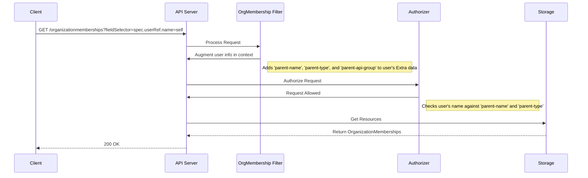

# Organization Memberships

## Overview

Organization memberships now manage both user-organization relationships and their role-based permissions within an organization. Memberships not only establish the association but also drive automation of RBAC by creating and managing PolicyBinding resources for each assigned role, simplifying access control.

## Goals

- Provide a Kubernetes-native, namespaced API to manage and query both organization-member relationships and their role-based permissions.
- Enable querying all members of an organization and all organizations a user is a member of, as well as their granted roles and effective permissions.
- Integrate with existing IAM and ResourceManager APIs and RBAC architecture in a transparent, automated way.
- Support automated creation and deletion of permissions (PolicyBindings) when roles are changed on a membership.
- Provide strong status and error tracking for each membership-role assignment.

## Non-Goals

- Decoupling membership from RBAC is no longer a non-goal: this enhancement now explicitly covers permissions within an organization and enforcement via automated PolicyBinding management and validation webhooks. Role definitions exist separately as Role resources, but role assignment and enforcement are integral to membership semantics.

## API

To represent the many-to-many relationship between `User` and `Organization` resources AND assign permissions, we introduce a namespaced `OrganizationMembership` custom resource under the `resourcemanager.miloapis.com/v1alpha1` API group. Role assignment is handled by referencing Role resources (which may be in different namespaces) and is strictly enforced and tracked.

### OrganizationMembership Resource

The `OrganizationMembership` resource declares a user-organization relationship and assigns one or more RBAC roles to the user within that organization. The controller:
- Automatically creates a PolicyBinding for each role, ensuring continuous and correct permissions.
- Tracks appliedRoles status on the membership resource to surface any role assignment issues.
- Automatically removes PolicyBindings when roles are removed from a membership.
- Prevents role duplicates and invalid references via a validating webhook.

**API Version and Scope**
- The resource is namespaced (namespace = the organization or logical RBAC scope).
- Kind: OrganizationMembership
- API Version: resourcemanager.miloapis.com/v1alpha1

**YAML Example:**

```yaml
apiVersion: resourcemanager.miloapis.com/v1alpha1
kind: OrganizationMembership
metadata:
  name: jane-acme-membership
  namespace: organization-acme-corp
spec:
  organizationRef:
    name: acme-corp
  userRef:
    name: jane-doe
  roles:
  - name: organization-viewer
    namespace: organization-acme-corp
```

#### Spec Fields
- **organizationRef**: { name: ... }
    - Reference to the Organization object (must exist before binding).
- **userRef**: { name: ... }
    - Reference to the User object (must exist before binding).
- **roles**:
    - Array of objects each containing:
        - name: The Role name (required; must exist where assigned)
        - namespace: The Role's namespace (optional; defaults to membership namespace)
    - Duplicates are forbidden (webhook and API validation will reject).
    - Cross-namespace roles are supported for shared/global permission models.
- **Status**: tracks results per role assignment, with details for each PolicyBinding (applied, pending, failed, error messages, etc).

#### Detailed Example with Multiple Roles and Status

```yaml
spec:
  roles:
    - name: organization-admin
      namespace: organization-acme-corp
    - name: billing-manager
      namespace: organization-acme-corp
    - name: shared-developer
      namespace: milo-system
status:
  appliedRoles:
    - name: organization-admin
      namespace: organization-acme-corp
      status: Applied
      policyBindingRef: { name: jane-acme-membership-xxx, namespace: ... }
      appliedAt: ...
    - name: invalid-role
      namespace: organization-acme-corp
      status: Failed
      message: "role 'invalid-role' not found in namespace 'organization-acme-corp'"
  conditions:
    - type: Ready
      status: "True"
      reason: Ready
    - type: RolesApplied
      status: "True"   # or "False"
      reason: AllRolesApplied | PartialRolesApplied | NoRolesSpecified
```

#### Related Resources
- **User**: The subject being given permissions.
- **Organization**: The target of membership and permission scope.
- **Role**: Permission bundle to be granted. May be defined in any namespace.
- **PolicyBinding**: Automatically managed by the controller for each assigned role.

### Usage
- **List all users in an organization**: List OrganizationMemberships by organization namespace (or by field selector on organizationRef.name).
- **List all organizations a user is a member of**: List OrganizationMemberships by field selector on userRef.name.
- **List all roles for a member**: Introspect the roles array and the status.appliedRoles field.
- **Cross-namespace/shared roles**: Set the namespace on a role entry to a different logical domain.
- **Audit status and errors**: Use status.appliedRoles and status.conditions for deep inspection/troubleshooting.

### Automated RBAC and PolicyBinding Management
- When a membership is created or updated, the controller ensures PolicyBindings exist (one per assigned role) and are correct.
- When a role is removed, the corresponding PolicyBinding is deleted.
- Garbage collection is handled via ownerReferences.
- status.appliedRoles precisely tracks per-role assignment, the referenced PolicyBinding, errors (if any), and timestamps.

### Webhook, Validation, and Conformance
- A validating webhook ensures each role exists, is referenced only once, and that references are structurally correct.
- Mutating and validation admission is performed for create and update operations.
- Duplicate roles are rejected both via +listType=map and the validating webhook.
- Cross-namespace roles are explicitly supported.

### Implementation and Workflow
1. User/admin creates or updates OrganizationMembership specifying desired roles.
2. Admission webhook validates uniqueness and existence of each referenced role.
3. Controller reconciles the membership:
   - For each role, creates or manages a PolicyBinding for that user & organization/role.
   - Updates appliedRoles in membership.status with result and references.
   - Removes PolicyBindings for roles that are no longer specified.
4. Status fields provide administrators with a detailed reconciliation state for all roles, including error diagnostics if any fail.
5. Deletion of a membership causes all owned PolicyBindings to be deleted via Kubernetes ownerReferences.

### Authorization
Access to OrganizationMembership resources and their effect on permissions is enforced with RBAC and custom authorization logic. The system supports fieldSelector-based RBAC filtering as described below.

#### Field Selector and Authorization Filter
The API server uses a custom request filter to populate extra request context fields when listing or querying OrganizationMemberships by field selector (e.g., organizationRef.name or userRef.name), enabling fine-grained RBAC and self-service.

1. Extract the query field (organizationRef.name or userRef.name).
2. Place the value(s) in user.Extra for downstream authorizers.
3. Allows flexible rules such as "user X may only see/edit their own memberships" or "an org admin may enumerate members in their org".

#### Sequence Diagram


