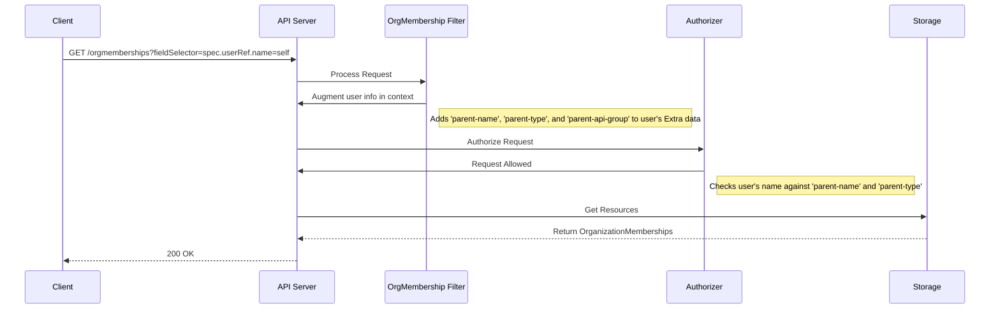

# Organization Memberships

## Overview

Organization memberships are a way to define the relationships between users and
organizations.

## Goals

- To provide a Kubernetes-native way to manage the relationship between users
  and organizations.
- To allow for querying all members of an organization.
- To allow for querying all organizations a user is a member of.
- The API should be consistent with the existing IAM and ResourceManager APIs.

## Non-Goals

- Role and permission definitions are covered separately in the IAM enhancement
- Authorization policy enforcement is handled by the authorization provider

## API

To represent the many-to-many relationship between `User` and `Organization`
resources, we will introduce a new `OrganizationMembership` custom resource.
This resource will be cluster-scoped.

### OrganizationMembership Resource

The `OrganizationMembership` resource links users to organizations:

```yaml
apiVersion: resourcemanager.miloapis.com/v1alpha1
kind: OrganizationMembership
metadata:
  name: alice-acme
  namespace: organization-acme
spec:
  organizationRef:
    name: acme
  userRef:
    name: alice
```

The `spec` contains:
- `organizationRef`: Reference to the `Organization`
- `userRef`: Reference to the `User`

#### Role Assignment (Optional)

Assign roles directly in the membership. The controller automatically creates and manages `PolicyBinding` resources:

```yaml
apiVersion: resourcemanager.miloapis.com/v1alpha1
kind: OrganizationMembership
metadata:
  name: alice-acme
  namespace: organization-acme
spec:
  organizationRef:
    name: acme
  userRef:
    name: alice
  roles:
    - name: organization-admin
      namespace: organization-acme
    - name: billing-manager
      namespace: organization-acme
```

Each role reference specifies:
- `name`: Role resource name
- `namespace`: Role namespace (optional, defaults to membership namespace)

The controller:
- Creates one `PolicyBinding` per role
- Updates PolicyBindings when roles change
- Deletes PolicyBindings when roles are removed
- Uses owner references for garbage collection
- Tracks status in `appliedRoles` field

### Usage

**List organization members:**
```bash
kubectl get organizationmemberships -n organization-acme
```

**List user's organizations:**
```bash
kubectl get organizationmemberships --all-namespaces \
  --field-selector spec.userRef.name=alice
```

**Check role assignment status:**
```bash
kubectl get organizationmembership alice-acme -n organization-acme -o yaml
```

Example status:
```yaml
status:
  appliedRoles:
    - name: organization-admin
      namespace: organization-acme
      status: Applied
    - name: billing-manager
      namespace: organization-acme
      status: Applied
  conditions:
    - type: Ready
      status: "True"
    - type: RolesApplied
      status: "True"
      reason: AllRolesApplied
      message: All 2 role(s) successfully applied
```

## Authorization

A custom filter in the API server handler chain manages access to `OrganizationMembership` resources. When a `fieldSelector` is present, the filter augments the user's authentication context for authorization decisions.

### Filter Logic

The filter runs before authorization:

1. Extracts `RequestInfo` from request context
2. Checks for `fieldSelector` in the request
3. Parses `fieldSelector` for `spec.userRef.name` or `spec.organizationRef.name`
4. Adds values to the user's `Extra` map:
   - For `spec.userRef.name=<user>`: Adds `iam.miloapis.com/parent-name`, `parent-type: User`, and `parent-api-group: iam.miloapis.com`
   - For `spec.organizationRef.name=<org>`: Adds `iam.miloapis.com/parent-name`, `parent-type: Organization`, and `parent-api-group: resourcemanager.miloapis.com`
5. Passes request with augmented context to next handler

The authorizer uses these `Extra` keys to apply authorization rules. For example, users can list their own memberships when `parent-type` is `User` and `parent-name` matches their username.

### Sequence Diagram

The following diagram illustrates the lifecycle of a request to list
`OrganizationMembership` resources:


