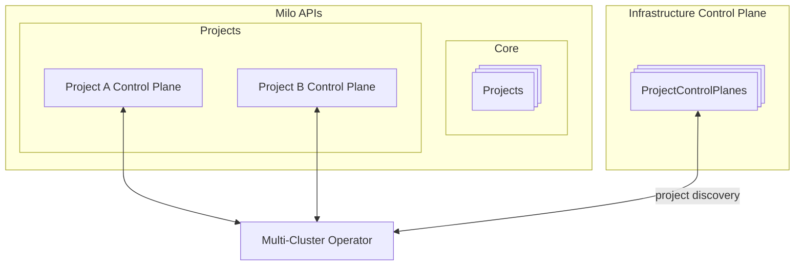
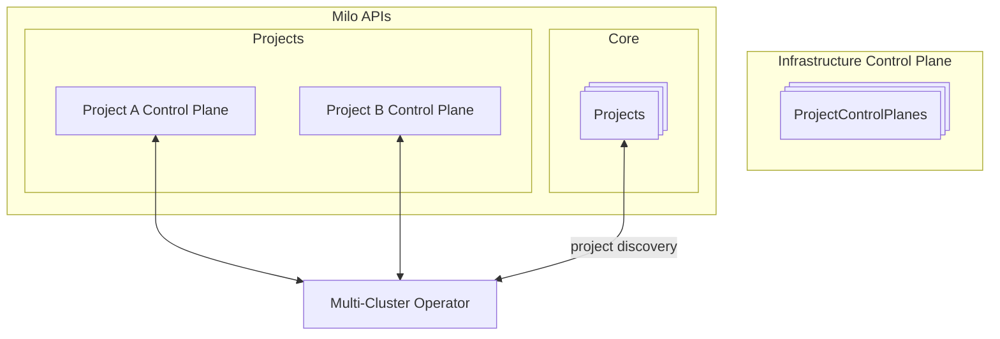

# Milo Provider Discovery Modes

The Milo provider supports two distinct discovery modes for connecting to
project clusters, each optimized for different deployment scenarios and
operational requirements.

## ProjectControlPlane

ProjectControlPlane mode uses internal service discovery within Milo's
infrastructure control plane to establish direct connections to project
clusters.

### How it Works

- Watches `ProjectControlPlane` resources in the infrastructure control plane
- Establishes connections using internal Kubernetes service addresses
- Connects directly to `milo-apiserver.project-{uid}.svc.cluster.local:6443`
- Requires the `ControlPlaneReady` condition to be true before engagement

### When to Use

- When the operator runs within the same Kubernetes cluster as the
  infrastructure control plane
- For internal operations and system-level controllers
- When network policies allow internal service-to-service communication
- Optimal performance due to direct internal networking

### Architecture



## Project

Project mode discovers clusters through the external Milo APIs and connects via
public endpoints.

### How it Works

- Watches `Project` resources through the core Milo APIs
- Constructs external API endpoints using the pattern:
  `/apis/resourcemanager.miloapis.com/v1alpha1/projects/{name}/control-plane`
- Requires the `Ready` condition to be true before engagement
- Uses external authentication and networking

### When to Use

- When the operator runs outside the infrastructure control plane
- For third-party integrations and external operators
- When connecting from remote locations or different clusters
- For customer-facing operators that need project isolation

### Architecture



## Configuration

The discovery mode is controlled by the `InternalServiceDiscovery` option:

```go
opts := milo.Options{
    InternalServiceDiscovery: true,  // Use ProjectControlPlane mode
    // InternalServiceDiscovery: false, // Use Project mode (default)
}
```
